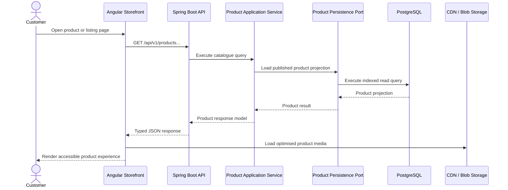
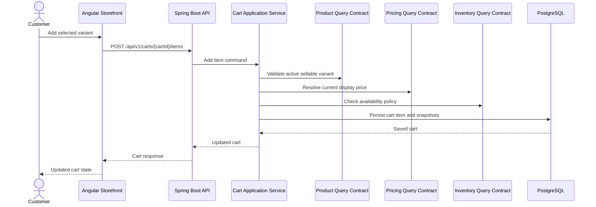
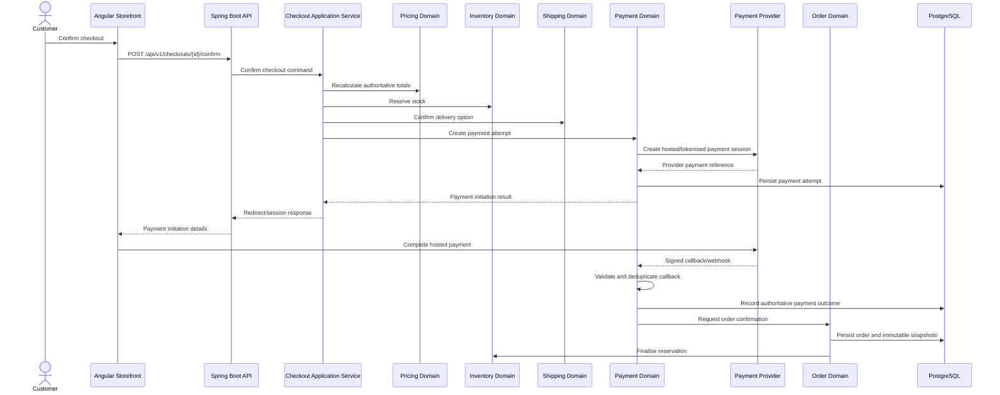
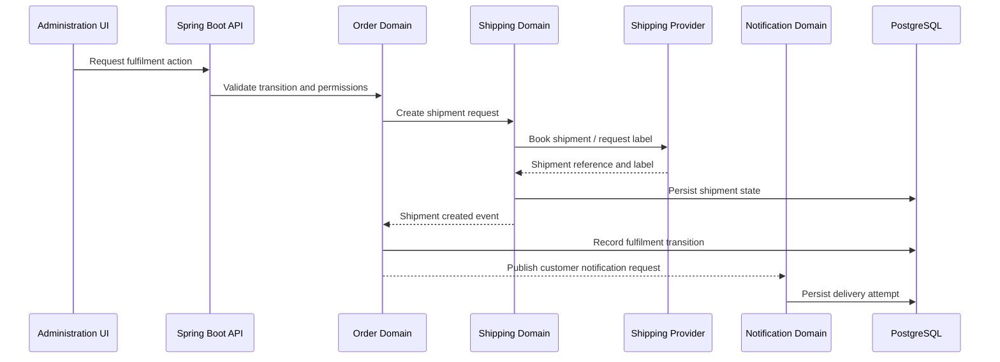
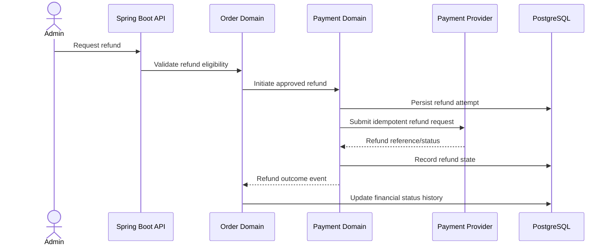
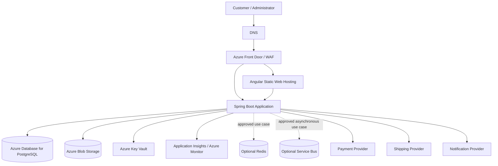

> **Release Status:** Version 1.0.0 establishes the approved architectural baseline for the Enterprise Fashion Commerce Platform. All implementation, domain specifications, technology standards, infrastructure definitions, and Architecture Decision Records must conform to this blueprint unless an accepted ADR explicitly changes the baseline.

# ARCHITECTURE.md

> Enterprise Fashion Commerce Platform — Authoritative Technical Blueprint

This document defines the approved architectural direction, system boundaries, quality attributes, dependency rules, and technology baseline for the Enterprise Fashion Commerce Platform. It must be read together with `.ai/core/AGENTS.md`. The constitution governs contributor behaviour; this document governs the technical shape of the platform.

## 1. Purpose and Authority

The purpose of this document is to ensure that all contributors design and implement the platform as one coherent system rather than as disconnected features.

It defines:

- The architectural vision and target state.
- The initial deployment and modularity strategy.
- The approved technology baseline.
- Domain ownership and dependency direction.
- Layer responsibilities and prohibited coupling.
- Integration, data, security, observability, performance, and resilience principles.
- The path for future evolution without premature distribution.

The statements **must**, **must not**, **required**, and **prohibited** are mandatory. The statements **should** and **should not** are strong defaults that may be overridden only through a documented reason. Material deviations require an accepted Architecture Decision Record.

Where guidance conflicts, the decision hierarchy in `.ai/core/AGENTS.md` applies.

## 2. Architectural Vision

The platform will provide a production-grade digital commerce capability for a premium fashion and streetwear business. It must support a refined customer storefront and reliable operational administration across catalogue, pricing, inventory, customer accounts, cart, checkout, payments, orders, fulfilment, shipping, content, notifications, and reporting.

The architecture must enable the business to:

- Present products and collections through a fast, mobile-first storefront.
- Maintain accurate product, price, variant, media, and inventory information.
- Accept secure online payments without storing raw card data.
- Create and fulfil orders reliably despite asynchronous provider behaviour.
- Operate through role-protected administration workflows.
- Diagnose failures and reconcile critical business processes.
- Introduce additional providers, channels, and capabilities without redesigning the core domain.

The initial system will be implemented as a **domain-driven modular monolith**. The frontend and backend will be separately deployable applications, while the backend will remain one primary deployable unit with strongly enforced internal module boundaries.

The platform must avoid premature microservices. Distribution will be considered only where independently measurable operational, scalability, security, deployment, ownership, or availability requirements justify the additional complexity.

## 3. Architecture Goals

The architecture must optimise for the following outcomes:

1. **Correctness:** prices, stock, payment outcomes, orders, refunds, and fulfilment state must remain trustworthy.
2. **Maintainability:** modules must be understandable and changeable without broad unintended impact.
3. **Security and privacy:** customer, administrative, payment, and operational data must be protected by default.
4. **Mobile-first usability:** customer-facing capabilities must perform and remain accessible on mobile devices.
5. **Operational simplicity:** the initial platform must be supportable by a small engineering team.
6. **Extensibility:** payment, shipping, notification, storage, search, and analytics providers must remain replaceable.
7. **Observability:** critical flows must be diagnosable through logs, metrics, traces, audit records, and correlation identifiers.
8. **Scalability:** the design must support horizontal application scaling and managed-service growth without premature decomposition.
9. **Testability:** business rules and integrations must be isolated behind testable boundaries.
10. **AI-assisted consistency:** repository context must enable multiple coding agents to produce changes aligned with the same architecture.

## 4. Quality Attributes

Quality attributes are architectural requirements, not optional refinements.

### 4.1 Security

The system must:

- Enforce authentication and authorization at trusted backend boundaries.
- Apply least privilege to users, services, databases, cloud identities, and pipelines.
- Store secrets in approved secret-management services.
- Encrypt data in transit and rely on approved encryption at rest.
- Validate all external input and safely encode output.
- Isolate external providers behind controlled adapters.
- Avoid storage of raw payment-card data.
- Produce auditable records for sensitive administrative and financial actions.

### 4.2 Reliability

The platform must preserve business truth under retries, duplicate requests, delayed callbacks, transient provider failure, and partial workflow failure.

Critical operations such as payment confirmation, refund initiation, inventory reservation, and order creation must be idempotent where duplication could create financial or operational harm.

### 4.3 Availability

The storefront should remain available for product browsing when non-essential providers are degraded. Failure of notifications, analytics, or non-authoritative integrations must not invalidate confirmed commercial operations.

Dependency health must be classified so that an optional provider outage does not unnecessarily make the entire application unavailable.

### 4.4 Performance

The architecture must support:

- Core Web Vitals targets defined in the engineering constitution.
- Efficient catalogue and product retrieval.
- Backend p95 response-time targets defined per API class.
- Responsive checkout interactions excluding unavoidable third-party latency.
- Optimised media delivery through object storage and edge caching.
- Query and index design based on actual access patterns.

### 4.5 Scalability

The backend must remain stateless at the HTTP application tier except for explicitly externalised session or cache state. Application instances must be horizontally scalable.

Stateful concerns must be owned by managed data services such as PostgreSQL, Redis where justified, object storage, or approved messaging infrastructure.

### 4.6 Maintainability

Architecture must favour explicit domain ownership, dependency direction, typed contracts, cohesive modules, and small application use cases.

A contributor must be able to identify where a business rule belongs without searching the entire repository.

### 4.7 Testability

Domain logic must be executable without HTTP, database, cloud, or provider dependencies. External integrations must be substitutable in tests through ports and adapters.

### 4.8 Accessibility

The storefront and administrative interface must target WCAG 2.2 AA. Accessibility requirements influence component design, navigation, forms, errors, loading states, and content structure.

### 4.9 Observability

Critical business workflows must expose sufficient telemetry to answer:

- What happened?
- Which customer, order, payment, shipment, or request was affected?
- Where did the workflow fail?
- Was the operation retried?
- Is business data consistent?
- What action is required?

## 5. Architectural Principles

### 5.1 Domain First

The system must be organised around business capabilities rather than framework layers alone. Domain terminology must remain consistent across requirements, code, APIs, events, data, tests, and operations.

### 5.2 Modular Monolith First

The backend will begin as one deployable Spring Boot application composed of explicit domain modules. Internal module boundaries must be treated as if modules could later become independently deployable.

This means:

- No uncontrolled cross-module repository access.
- No shared mutable domain entities.
- No circular module dependencies.
- Cross-domain interaction through approved application interfaces, queries, APIs, or events.
- Independent ownership of business rules and authoritative data.

### 5.3 Hexagonal Architecture

Each backend domain module should follow ports-and-adapters principles:

- The domain defines business behaviour and invariants.
- The application layer coordinates use cases.
- Inbound adapters expose capabilities through REST, scheduled jobs, messaging, or administrative commands.
- Outbound ports describe persistence, provider, notification, storage, search, and event needs.
- Infrastructure adapters implement those ports.

Framework and provider details must point inward toward project-owned abstractions; domain logic must not depend outward on frameworks or vendors.

### 5.4 API First

Externally consumed HTTP contracts must be designed and documented using OpenAPI before or alongside implementation. Consumers must not rely on persistence models or undocumented response shapes.

### 5.5 Secure by Default

The default path must be the secure path. Public access, elevated permissions, broad cloud roles, sensitive logging, and relaxed validation require explicit justification.

### 5.6 Observable by Design

Telemetry must be designed with the workflow rather than added only after incidents occur.

### 5.7 Managed Services First

Use managed cloud services where they materially reduce operational burden and provide suitable security, availability, backup, and scaling characteristics.

### 5.8 Explicit Consistency

Every workflow that crosses domains or providers must define its consistency model. Contributors must not assume a distributed transaction exists across the database and external systems.

### 5.9 Backward-Compatible Evolution

APIs, events, schemas, and deployment changes should evolve additively. Breaking changes require versioning, migration sequencing, and deprecation guidance.

### 5.10 Simplicity with an Evolution Path

Choose the simplest architecture that safely satisfies current requirements. Preserve replaceable boundaries so the platform can evolve without speculative infrastructure.

## 6. High-Level System Context

The primary actors and external systems are:

| Actor or System         | Responsibility                                                                                                   |
| ----------------------- | ---------------------------------------------------------------------------------------------------------------- |
| Customer                | Browses, searches, saves products, checks out, pays, and tracks orders.                                          |
| Store Administrator     | Manages products, inventory, pricing, orders, content, customers, users, and reports according to permissions.   |
| Support Agent           | Investigates customer, payment, order, shipment, and communication issues.                                       |
| Angular Web Application | Provides the customer storefront and protected administration experience.                                        |
| Spring Boot Application | Owns business use cases, domain rules, security enforcement, persistence coordination, and external integration. |
| PostgreSQL              | Stores authoritative transactional and configuration data.                                                       |
| Object Storage and CDN  | Stores and distributes product media and approved static assets.                                                 |
| Payment Provider        | Hosts or processes approved payment methods and emits authoritative payment notifications.                       |
| Shipping Provider       | Provides delivery quotations, shipment creation, labels, tracking, and delivery events.                          |
| Notification Provider   | Delivers transactional email or other approved communications.                                                   |
| Analytics Platform      | Receives consent-aware customer and business events.                                                             |
| Azure Platform Services | Provide hosting, identity, secrets, networking, monitoring, backup, and managed data capabilities.               |

The browser must never communicate directly with the database. Direct browser-to-provider flows may be used only where the provider’s secure hosted pattern requires them, and authoritative confirmation must still be validated by the backend.

## 7. Target Technology Stack

The approved initial baseline is:

| Area                        | Technology Direction                                                                                                                                        |
| --------------------------- | ----------------------------------------------------------------------------------------------------------------------------------------------------------- |
| Customer and Admin Frontend | Angular 20 with standalone components, TypeScript strict mode, Signals-first state, RxJS for asynchronous streams, Angular Router, and typed Reactive Forms |
| Backend                     | Java 21 LTS and the approved Spring Boot 3.x release defined in `.ai/backend/SPRING.md`                                                                     |
| API                         | REST-first JSON APIs documented with OpenAPI 3.1                                                                                                            |
| Security                    | Spring Security with approved token/session strategy and role/permission authorization                                                                      |
| Persistence                 | PostgreSQL with versioned Flyway migrations                                                                                                                 |
| Cache                       | Redis only for justified cache, session, idempotency, or coordination use cases                                                                             |
| Object Storage              | Azure Blob Storage                                                                                                                                          |
| Edge Delivery               | Azure Front Door and/or approved CDN capability                                                                                                             |
| Application Hosting         | Azure App Service or Azure Container Apps, selected through ADR                                                                                             |
| Secrets                     | Azure Key Vault and managed identities where supported                                                                                                      |
| Observability               | OpenTelemetry-compatible instrumentation, Application Insights, Azure Monitor, and Log Analytics                                                            |
| CI/CD                       | GitHub Actions with protected environments and least-privilege permissions                                                                                  |
| Infrastructure as Code      | Bicep or Terraform, selected and standardised through ADR                                                                                                   |
| Testing                     | JUnit, Spring Boot Test, Testcontainers, frontend unit/component tools, Playwright, accessibility and contract testing                                      |
| Documentation               | Markdown, OpenAPI, Mermaid/PlantUML/Draw.io source, and ADRs in Git                                                                                         |

Technology-specific details belong in the corresponding `.ai/backend/` and `.ai/frontend/` standards. Those files may refine but must not contradict this blueprint.

## 8. Architectural Style

### 8.1 Deployment Model

The initial production topology consists of:

- One Angular web application deployment.
- One Spring Boot backend deployment that may run multiple stateless instances.
- One primary PostgreSQL database service.
- Object storage for media.
- Optional Redis introduced only for approved use cases.
- External payment, shipping, notification, and analytics providers.
- Azure-managed identity, secrets, monitoring, and networking services.

### 8.2 Modular Monolith

A modular monolith is selected because it provides:

- Strong transactional support for closely related commerce workflows.
- Lower operational complexity than microservices.
- Easier local development and integration testing.
- Clear domain boundaries without premature network distribution.
- A credible future extraction path when module characteristics justify it.

The modular monolith must not become an unstructured monolith. Module boundaries must be enforced through package structure, tests, ownership, and dependency rules.

### 8.3 Future Module Extraction

A module may be considered for independent deployment only when one or more of the following are demonstrated:

- It requires materially different scaling characteristics.
- It requires independent release cadence or ownership.
- It has a distinct security or compliance boundary.
- Its failure must be isolated from the core transaction path.
- Its technology or data needs are incompatible with the primary runtime.
- Operational evidence shows that distribution provides more value than complexity.

Extraction requires an ADR, contract definition, data-ownership plan, observability plan, deployment strategy, and failure-mode analysis.

## 9. Business Domains

| Domain         | Primary Responsibility                                                                                        |
| -------------- | ------------------------------------------------------------------------------------------------------------- |
| Product        | Owns product definitions, variants, attributes, publication lifecycle, and product media metadata.            |
| Category       | Owns hierarchical classification and customer navigation groupings.                                           |
| Inventory      | Owns on-hand, reserved, available-to-sell quantities, reservations, adjustments, and movements.               |
| Pricing        | Owns prices, promotional rules, voucher eligibility, discounts, and pricing policy.                           |
| Customer       | Owns customer profiles, addresses, preferences, and consent records.                                          |
| Identity       | Owns credentials, authentication sessions, roles, permissions, and access-security events.                    |
| Cart           | Owns active purchase intent, cart items, quantity changes, and cart persistence.                              |
| Checkout       | Coordinates final validation of customer, pricing, promotion, inventory, shipping, and payment initiation.    |
| Payment        | Owns payment attempts, provider references, callbacks, payment state, refunds, and reconciliation.            |
| Order          | Owns confirmed commercial records, order snapshots, lifecycle, status history, and cancellation coordination. |
| Shipping       | Owns methods, quotations, shipments, tracking, and delivery events.                                           |
| Notifications  | Owns templates, notification requests, attempts, retry state, and delivery outcome.                           |
| CMS            | Owns editorial pages, banners, homepage content, campaigns, and policy presentation.                          |
| Administration | Provides protected operational workflows over domain-owned application services.                              |
| Reporting      | Owns read models, exports, dashboards, and analytical projections without mutating transactional state.       |

Detailed ownership rules remain governed by `.ai/core/AGENTS.md` and domain specifications under `specifications/domains/`.

## 10. Domain-Driven Modular Structure

The backend root package should be organised by business capability:

```text
com.enterprisefashioncommerce
├── identity
├── customer
├── product
├── category
├── inventory
├── pricing
├── cart
├── checkout
├── payment
├── order
├── shipping
├── notification
├── cms
├── administration
├── reporting
└── shared
```

The `shared` area must remain small and may contain only genuine cross-cutting technical primitives or stable value types. It must not become a location for business logic that lacks clear ownership.

Each domain module should expose only its approved application-facing contract. Internal domain objects, repositories, persistence mappings, and provider adapters must remain encapsulated.

### 10.1 Dependency Direction

Allowed dependency direction is:

```text
Presentation / Inbound Adapters
            ↓
      Application Layer
            ↓
        Domain Layer
```

Infrastructure adapters implement ports defined inward by the application or domain layer:

```text
Infrastructure Adapter → Application or Domain Port
```

The domain layer must not depend on Spring MVC, JPA, Azure SDKs, HTTP clients, payment SDKs, or other infrastructure frameworks.

### 10.2 Cross-Domain Interaction

Cross-domain interaction should use one of the following:

- A public application-service interface.
- An explicit query contract.
- A documented internal API.
- A domain event inside the same process.
- An integration event when asynchronous or externally visible communication is required.

Direct access to another domain’s internal repository, entity, or table is prohibited unless an accepted ADR defines a controlled exception.

### 10.3 Transaction Boundaries

Transactions must be defined around application use cases, not controllers.

A single database transaction may coordinate changes across closely related modules only when the consistency requirement is explicit and module encapsulation remains intact. External provider calls must not be held inside long-running database transactions.

## 11. Layered and Hexagonal Architecture

Each significant backend module should use the following conceptual layers.

### 11.1 Domain Layer

Owns:

- Aggregates and entities.
- Value objects.
- Domain services.
- Business invariants.
- Domain events.
- Domain-specific errors and policies.

The domain layer must be framework-independent wherever practical.

### 11.2 Application Layer

Owns:

- Named use cases.
- Command and query orchestration.
- Transaction boundaries.
- Authorization checks requiring business context.
- Coordination of repositories, domain services, and external ports.
- Mapping between inbound requests and domain/application models.
- Publication of approved events.

The application layer must not contain presentation-specific behaviour.

### 11.3 Inbound Adapters

Examples include:

- REST controllers.
- Scheduled jobs.
- Administrative commands.
- Message consumers.
- Provider callback endpoints.

Inbound adapters translate transport concerns into application use cases. They must not own business rules.

### 11.4 Outbound Ports

Ports describe what the application requires from external capabilities, such as:

- Persistence.
- Payment processing.
- Shipping quotations and booking.
- Notification delivery.
- Media storage.
- Search indexing.
- Clock and identifier generation.
- Event publication.

Ports must use project-owned types rather than leaking provider SDK models inward.

### 11.5 Outbound Adapters

Adapters implement ports through:

- Spring Data JPA.
- HTTP clients.
- Azure SDKs.
- Payment or courier SDKs.
- Email providers.
- Redis.
- Messaging services.

Provider-specific translation, validation, signatures, timeouts, retries, and errors belong in adapters.

### 11.6 Persistence Mapping

Persistence entities must not be exposed through REST APIs or used as domain models by default. Mapping may be explicit or implemented with approved mapping tools, but it must remain understandable and testable.

## 12. Frontend Architecture Direction

The Angular application will use:

- Standalone components.
- Feature-oriented folders.
- Route-level lazy loading.
- Signals for local synchronous state.
- RxJS for HTTP, event streams, and asynchronous composition.
- Typed Reactive Forms.
- Reusable design-system components.
- Separate storefront and administration layouts.
- Server-side authorization as the authoritative access boundary.

The frontend may validate user input for usability but must not become the authoritative owner of price, stock, payment, permission, or order rules.

Further rules are defined in `.ai/frontend/ANGULAR.md`, `.ai/frontend/UI.md`, `.ai/frontend/ACCESSIBILITY.md`, `.ai/frontend/PERFORMANCE.md`, and `.ai/frontend/STORYBOOK.md`.

## 13. API Architecture Direction

The platform will use REST-first APIs under the approved versioned base path `/api/v1`. Any alternative versioning mechanism requires an ADR and corresponding update to `.ai/backend/API.md`.

APIs must:

- Use resource-oriented naming.
- Return project-owned DTOs.
- Apply consistent pagination, filtering, and sorting.
- Use RFC 7807-style problem responses with stable error codes.
- Support idempotency for duplicate-sensitive commands.
- Propagate correlation identifiers.
- Enforce authentication and authorization at the backend.
- Be documented with OpenAPI 3.1.
- Evolve additively where possible.

GraphQL is not part of the initial platform baseline. Its introduction would require a documented need and an ADR.

## 14. Event Architecture Direction

Events may be used for decoupled reactions, audit-friendly state propagation, provider integration, notifications, reporting projections, and future module extraction.

### 14.1 Domain Events

Domain events represent completed facts inside the application boundary, such as:

- `ProductPublished`
- `StockReserved`
- `PaymentSucceeded`
- `OrderConfirmed`
- `ShipmentCreated`

They are expressed in past tense and must not be used as hidden commands.

### 14.2 Integration Events

Integration events are stable, versioned messages intended for asynchronous consumers outside the originating module or deployable system.

### 14.3 Reliability

When reliable publication must be coordinated with database state, the architecture should use an outbox pattern or another accepted durable mechanism.

Consumers must be idempotent because event delivery may be at least once.

### 14.4 Initial Position

The initial modular monolith may use in-process events for appropriate internal reactions. External messaging infrastructure should be introduced only when required by reliability, decoupling, scale, or integration needs.

## 15. Data Architecture Direction

PostgreSQL is the authoritative transactional database.

The data architecture must provide:

- Explicit ownership of tables and write operations by domain.
- UUID-based business identifiers according to database standards.
- Referential integrity and appropriate database constraints.
- Versioned Flyway migrations.
- UTC timestamps and explicit currency codes.
- Optimistic locking for concurrent mutable aggregates where required.
- Immutable snapshots for confirmed order and financial history.
- Append-only movements or histories for critical inventory, payment, order, and audit changes.
- Purpose-specific read models or projections for reporting when required.

Direct database integration between external systems and domain tables is prohibited.

Search may initially use PostgreSQL capabilities. A dedicated search service may be introduced behind a search port when product scale, relevance, merchandising, or latency requirements justify it.

## 16. Integration Architecture Direction

External systems must be integrated behind project-owned ports and adapters.

Every integration must define:

- Authentication and secret handling.
- Request and response mapping.
- Timeouts.
- Retry policy.
- Idempotency behaviour.
- Rate limits.
- Error classification.
- Observability.
- Reconciliation process.
- Sandbox and production configuration.
- Failure and recovery behaviour.

Provider SDK or payload types must not leak into core domain logic.

The initial provider categories are:

- Payments.
- Shipping and courier services.
- Transactional notifications.
- Object storage.
- Analytics.
- Optional address or fraud services when approved.

## 17. Security Architecture Direction

Security architecture includes:

- Customer and administrative authentication.
- Role and permission authorization.
- Short-lived access credentials and revocable session or refresh strategy.
- Secure password hashing.
- Rate limiting and brute-force protection.
- Hosted or tokenised payment processing.
- Provider callback signature validation.
- Encryption in transit.
- Secret management through Azure Key Vault.
- Managed identities where supported.
- Secure headers, CORS, and CSRF controls appropriate to the chosen session model.
- Audit logging for sensitive operations.
- Data minimisation and privacy-aware retention.

Detailed controls belong in `.ai/core/SECURITY-STANDARDS.md` and technology-specific standards.

## 18. Observability Architecture Direction

The system must use structured, correlated telemetry.

Required capabilities include:

- Structured application logs.
- Correlation IDs across browser, API, providers, events, and jobs where possible.
- Distributed tracing with OpenTelemetry-compatible instrumentation.
- Technical metrics for latency, throughput, error rate, saturation, and dependency health.
- Business metrics for checkout, payment, order, fulfilment, refund, and notification outcomes.
- Audit records distinct from diagnostic logs.
- Health and readiness endpoints.
- Actionable dashboards and alerts.

Critical workflows must be traceable by business identifier, such as order number, payment reference, shipment reference, or inventory reservation ID, without logging prohibited sensitive data.

## 19. Azure Deployment Direction

The target Azure architecture must provide the following logical capabilities; exact Azure service selections remain governed by accepted ADRs:

- Azure Front Door and approved web edge controls.
- Static hosting suitable for the Angular application.
- Azure App Service or Azure Container Apps for the Spring Boot application.
- Azure Database for PostgreSQL.
- Azure Blob Storage for media.
- Azure Key Vault.
- Application Insights, Azure Monitor, and Log Analytics.
- Managed identities and least-privilege role assignments.
- Budget alerts and environment-level cost controls.

Redis, Service Bus, private endpoints, advanced network isolation, and additional managed services will be introduced when justified by approved requirements and cost.

Environments must be logically separated at minimum into local, development, test/QA, and production. Production data and secrets must not be reused in lower environments except through approved, sanitised processes.

## 20. Resilience and Consistency Direction

### 20.1 External Calls

All external calls must use explicit timeouts. Retries must be bounded and restricted to safe failure classes. Non-idempotent operations must not be retried blindly.

### 20.2 Payment and Order Consistency

The platform must not treat a customer redirect as proof of payment. Authoritative payment confirmation must come from validated provider state, normally through a signed callback or server-side verification.

Duplicate callbacks must not create duplicate orders or side effects.

### 20.3 Inventory Consistency

Inventory must define explicit reservation, expiry, release, and finalisation behaviour. Available-to-sell quantity must not be calculated independently by multiple domains.

### 20.4 Notification Failure

Notification delivery failure must not invalidate a confirmed order, payment, or shipment. Failed notifications must be retryable and observable.

### 20.5 Reconciliation

Payment, order, inventory, shipment, and notification integrations must provide reconciliation mechanisms for uncertain or inconsistent state.

## 21. Architecture Decision Process

An ADR is required when a decision:

- Introduces or replaces a major technology.
- Changes module boundaries or ownership.
- Creates a new integration style.
- Introduces infrastructure with material cost or operational impact.
- Changes API, event, identity, persistence, or deployment strategy.
- Creates a long-lived exception to this document.
- Is difficult or expensive to reverse.

ADRs must document context, decision, alternatives, consequences, status, and migration impact.

This document records the architectural baseline. ADRs record individual decisions and must not silently contradict the baseline. Accepted contradictions require this document to be updated.

## 22. Architecture Governance and Fitness

Architecture must be protected through automated and manual controls.

Recommended fitness functions include:

- Architecture tests that prevent prohibited module dependencies.
- CI validation of OpenAPI and schema compatibility.
- Migration validation.
- Dependency and vulnerability scanning.
- Bundle and performance budgets.
- Test coverage of domain invariants.
- Secret scanning.
- Infrastructure policy checks.

Code review must confirm both local correctness and alignment with the target architecture.

## 23. Out of Scope for Version 1

The following are not part of the initial architecture unless later approved:

- Independent microservices for each domain.
- Multi-region active-active deployment.
- Multi-tenant SaaS operation.
- Native mobile applications.
- International multi-currency settlement.
- Marketplace and third-party sellers.
- Event sourcing as the primary persistence model.
- Full CQRS across all domains.
- Complex warehouse-management functionality.
- Real-time AI recommendations in the critical purchase path.
- Social login, passwordless login, or mandatory customer MFA.
- Dedicated search infrastructure before requirements justify it.

Exclusion from version 1 does not prohibit future evolution. It prevents speculative complexity from entering the initial platform without evidence.

## 24. Logical Component Model

The platform is composed of independently understandable logical components. Logical separation does not imply independent deployment in Version 1.

### 24.1 Frontend Components

The Angular application contains the following major logical areas:

| Component              | Responsibility                                                                                                                          |
| ---------------------- | --------------------------------------------------------------------------------------------------------------------------------------- |
| Storefront Shell       | Owns customer-facing layout, global navigation, route composition, footer, search entry, account entry, wishlist entry, and cart entry. |
| Administration Shell   | Owns protected administration layout, permission-aware navigation, breadcrumbs, environment indicators, and operational workspaces.     |
| Design System          | Owns reusable visual tokens, components, accessibility behaviour, interaction patterns, and Storybook documentation.                    |
| Feature Areas          | Own route-level customer and administration experiences grouped by business capability.                                                 |
| API Client Layer       | Owns typed HTTP communication, error translation, correlation propagation, and transport DTOs.                                          |
| Client State           | Owns local UI state, route state, and explicitly approved cross-feature state.                                                          |
| Analytics Adapter      | Owns consent-aware translation of application events into analytics-provider events.                                                    |
| Frontend Observability | Owns client-side error capture, performance telemetry, and correlation context.                                                         |

Feature areas must not import the internal implementation of unrelated feature areas. Shared behaviour must be promoted deliberately into the design system, an approved shared frontend service, or a project-owned contract.

### 24.2 Backend Components

The Spring Boot application contains:

| Component                    | Responsibility                                                                                                           |
| ---------------------------- | ------------------------------------------------------------------------------------------------------------------------ |
| REST API Adapters            | Translate HTTP requests into application use cases and application results into HTTP responses.                          |
| Security Boundary            | Authenticates principals, resolves roles and permissions, applies request-level controls, and supplies security context. |
| Domain Modules               | Own business invariants, application use cases, persistence ports, domain events, and provider ports.                    |
| Integration Adapters         | Implement payment, shipping, notification, storage, analytics, and other provider contracts.                             |
| Persistence Adapters         | Map project-owned domain and application models to PostgreSQL persistence structures.                                    |
| Event Infrastructure         | Dispatches in-process events and, when approved, persists and publishes integration events.                              |
| Scheduled Operations         | Run reconciliation, expiry, cleanup, notification retry, projection, and maintenance jobs.                               |
| Observability Infrastructure | Produces structured logs, metrics, traces, health information, and audit records.                                        |

### 24.3 Data Components

The data architecture distinguishes:

- Transactional domain tables.
- Immutable business snapshots.
- Append-only movement and status history.
- Outbox and idempotency records where required.
- Reporting projections and export models.
- Operational audit records.
- Object-storage metadata.

Reporting read models must not become hidden transactional authorities.

### 24.4 Infrastructure Components

The Azure deployment contains logical capabilities for:

- Edge routing and protection.
- Frontend hosting and content distribution.
- Backend compute.
- Relational data.
- Object storage.
- Secret management.
- Monitoring and telemetry.
- Identity and access management.
- CI/CD and protected deployment environments.
- Optional cache and messaging capabilities introduced through ADRs.

## 25. Reference Request Flows

Reference flows define the intended architectural path through the system. Domain specifications may refine them but must preserve ownership and trust boundaries.

### 25.1 Product Browsing Flow



The read path must use published and customer-visible data only. Administrative draft state must not leak into public responses.

### 25.2 Add-to-Cart Flow



Cart pricing is provisional. Checkout must revalidate authoritative price, promotion, and stock before payment initiation.

### 25.3 Checkout and Payment Flow



The order must not be confirmed from the browser redirect alone. Callback handling must be idempotent and reconciliation-capable.

### 25.4 Order Fulfilment Flow



Administration must invoke domain-owned use cases rather than writing order or shipment state directly.

### 25.5 Refund Flow



Refund state must remain independently reconcilable from order state.

## 26. Consistency and Transaction Model

### 26.1 Strong Consistency

Strong consistency is required inside a single transactional boundary when failure would otherwise violate a core invariant.

Examples include:

- Persisting an inventory reservation with the corresponding quantity change.
- Persisting an order and its order-item snapshots.
- Recording a payment callback and its deduplication marker.
- Applying a promotion-usage record with its approved use count where required.

### 26.2 Eventual Consistency

Eventual consistency is acceptable for non-authoritative reactions and projections, including:

- Notification delivery.
- Analytics events.
- Reporting projections.
- Search indexing.
- Non-critical cache invalidation.
- Secondary operational dashboards.

The originating transaction must remain correct even when an eventual consumer is delayed or unavailable.

### 26.3 External Side Effects

Database transactions must not remain open while waiting for payment, shipping, email, analytics, or storage providers.

A workflow that combines database state and an external side effect must use an explicit state machine and, where required, durable command/outbox records.

### 26.4 Idempotency

Idempotency must be designed for:

- Checkout confirmation.
- Payment-session creation when provider semantics require it.
- Payment callbacks.
- Refund requests.
- Shipment creation.
- Inventory reservation finalisation and release.
- Notification consumers.
- Integration-event consumers.

Idempotency records must define key scope, request identity, result reuse, expiry, conflict behaviour, and storage ownership.

### 26.5 Optimistic Concurrency

Optimistic concurrency is the default for mutable aggregates that may be edited concurrently. Conflicts must return an explicit error and must not silently overwrite another committed change.

### 26.6 Scheduled Recovery

Scheduled recovery jobs may resolve:

- Expired inventory reservations.
- Stale checkout sessions.
- Unconfirmed payment attempts.
- Unpublished outbox records.
- Failed notification attempts.
- Shipment-status drift.

Recovery jobs must be idempotent, observable, bounded, and safe to rerun.

## 27. Caching Architecture

Caching is an optimisation and must never become an ungoverned source of truth.

### 27.1 Cache Candidates

Suitable candidates may include:

- Published catalogue projections.
- Category navigation.
- CMS content.
- Shipping reference data.
- Short-lived provider-independent lookups.
- Rate-limit counters.
- Explicit idempotency or session state where approved.

### 27.2 Cache Exclusions

The following must not rely on stale cache state for authoritative decisions:

- Final checkout totals.
- Payment status.
- Order financial status.
- Inventory reservation outcome.
- Permissions.
- Refund eligibility.

### 27.3 Cache Policy

Every cache must define:

- Owner.
- Key format.
- Value contract.
- Time to live.
- Invalidation strategy.
- Staleness tolerance.
- Failure behaviour.
- Observability.

The application must have a correct fallback when a non-essential cache is unavailable.

### 27.4 Browser and Edge Caching

Static assets and immutable versioned media should use long-lived cache headers. HTML and personalised responses require conservative caching rules. Public API caching must consider authorization, locale, query parameters, and content visibility.

## 28. Search Architecture

### 28.1 Initial Search

Version 1 may implement product search through PostgreSQL using approved text-search and indexing capabilities.

The initial search contract must support:

- Customer-visible published products only.
- Keyword search.
- Category filtering.
- Attribute and variant filtering where supported.
- Price filtering.
- Sort options.
- Pagination.
- Stable response metadata.

### 28.2 Search Port

Search access must be expressed through a project-owned search port so a dedicated search engine can be introduced without rewriting customer-facing use cases.

### 28.3 Dedicated Search Criteria

A dedicated search service may be justified by:

- Catalogue scale.
- Advanced relevance requirements.
- Synonyms, typo tolerance, or language analysis.
- Faceting performance.
- Merchandising controls.
- Search-specific availability requirements.
- Operational evidence that PostgreSQL no longer meets agreed targets.

### 28.4 Index Consistency

A dedicated search index is a projection, not the source of truth. Index updates must be replayable and reconcilable from authoritative catalogue data.

## 29. Media Architecture

### 29.1 Storage

Product and CMS media must be stored in approved object storage rather than the application filesystem or relational database.

### 29.2 Upload Flow

Uploads must use an approved controlled flow that validates:

- File size.
- Declared MIME type.
- File signature.
- Image dimensions.
- Supported formats.
- Malware or content scanning where required.
- Access permissions.

Client-provided filenames must not be trusted as storage paths.

### 29.3 Processing

The platform should generate or accept optimised renditions appropriate for:

- Product cards.
- Product galleries.
- Hero content.
- Thumbnails.
- Social sharing.

Original assets and derived renditions must have traceable metadata.

### 29.4 Delivery

Media should be delivered through edge caching with responsive dimensions and modern formats such as WebP or AVIF where client support permits.

### 29.5 Deletion

Media deletion must consider product references, order-history needs, CMS usage, retention, and orphan cleanup. A storage object must not be deleted while an authoritative record still references it.

## 30. Identity and Access Architecture

### 30.1 Identity Separation

Identity owns authentication credentials and sessions. Customer owns customer profile and preference data. Administration consumes identity roles and permissions but must not create a second authorization model.

### 30.2 Customer Authentication

Customer authentication must support:

- Secure registration.
- Login and logout.
- Password reset.
- Session or refresh revocation.
- Brute-force controls.
- Future email verification and MFA readiness.

### 30.3 Administrative Authentication

Administrative access requires stronger controls than ordinary storefront browsing. The architecture must support:

- Explicit staff roles and permissions.
- Controlled account provisioning.
- Session revocation.
- Audit events.
- Future MFA enforcement.
- Environment and operational access separation.

### 30.4 Authorization

Authorization must be enforced in the backend at both coarse route/use-case level and, where required, business-object level.

The frontend may hide unavailable actions for usability but must not be trusted to enforce permission.

### 30.5 Session Strategy

The exact token or session model requires an ADR. The selected design must address:

- Access credential lifetime.
- Refresh/session revocation.
- Rotation and replay detection.
- Browser storage and cookie protections.
- CSRF implications.
- CORS implications.
- Logout semantics.
- Multi-device behaviour.

## 31. Deployment Topology

The following diagram represents the approved logical Azure topology. Service selections shown as alternatives or optional capabilities require supporting ADRs and infrastructure specifications before implementation.



### 31.1 Network Boundaries

Production infrastructure should minimise public exposure. Databases, secret stores, caches, and messaging services must not be publicly reachable unless an accepted design explicitly requires it.

### 31.2 Environment Isolation

Development, test/QA, and production must use separate configuration, secrets, identities, databases, and deployment controls. Cost-aware shared non-production infrastructure may be considered only where data and access isolation remain acceptable.

### 31.3 Configuration

Configuration must be externalised and validated at startup. Sensitive configuration must be sourced from approved secret management. Environment configuration must not change business semantics unexpectedly.

### 31.4 Deployment Safety

Deployments should support:

- Reproducible artifacts.
- Environment approvals.
- Health verification.
- Database migration sequencing.
- Rollback or forward-fix strategy.
- Smoke testing.
- Controlled feature activation.

## 32. Availability, Backup, and Recovery

### 32.1 Availability Priorities

The platform prioritises availability of:

1. Storefront browsing.
2. Cart and checkout.
3. Payment confirmation and order creation.
4. Administrative fulfilment.
5. Customer account and order tracking.
6. Notifications, analytics, and reporting.

Lower-priority capabilities must not unnecessarily block higher-priority flows.

### 32.2 Backup

Production PostgreSQL and object-storage configuration must use approved backup and retention policies. Backup success must be monitored.

### 32.3 Restore Testing

Backups are not considered reliable until restoration has been tested. Restore tests must validate data integrity, application compatibility, and documented recovery steps.

### 32.4 Recovery Objectives

Formal Recovery Time Objective and Recovery Point Objective values must be defined before production launch based on business impact and service cost.

### 32.5 Disaster Recovery

Version 1 may use a single Azure region with documented recovery procedures unless business requirements justify multi-region capability. The architecture must avoid undocumented dependencies that prevent rebuilding the environment from source-controlled infrastructure and backups.

## 33. Architecture Risks and Controls

| Risk                                                    | Architectural Control                                                                                         |
| ------------------------------------------------------- | ------------------------------------------------------------------------------------------------------------- |
| Modular monolith degrades into tightly coupled code     | Enforce package boundaries, public module contracts, architecture tests, and ADR review.                      |
| Duplicate payment callbacks create duplicate orders     | Use callback signature validation, idempotency keys, unique constraints, and reconciliation.                  |
| Inventory is oversold                                   | Centralise available-to-sell logic, use reservations, concurrency controls, and expiry/release workflows.     |
| Provider outage blocks all commerce                     | Isolate providers behind adapters, apply timeouts, degrade optional capabilities, and use recovery workflows. |
| Frontend becomes source of business truth               | Revalidate price, stock, payment, permissions, and order rules in backend domains.                            |
| Reporting queries harm transactions                     | Use indexed projections, exports, or dedicated read models.                                                   |
| Shared module accumulates business logic                | Restrict shared contents and require domain ownership review.                                                 |
| Search index becomes inconsistent                       | Treat search as a projection with replay and reconciliation.                                                  |
| Secrets leak through code or pipelines                  | Use Key Vault, managed identities, secret scanning, and least-privilege workflows.                            |
| Architecture documentation diverges from implementation | Update documents in the same PR and enforce architecture fitness checks.                                      |

## 34. Open Architectural Decisions

The following decisions must be resolved through ADRs before their respective implementation becomes binding:

1. Azure App Service versus Azure Container Apps for backend hosting.
2. Bicep versus Terraform for infrastructure as code.
3. Customer and administrator session/token strategy.
4. Frontend hosting service and server-side rendering or prerendering strategy.
5. Payment provider selection.
6. Shipping provider selection.
7. Transactional notification provider selection.
8. Redis introduction and its approved use cases.
9. External messaging introduction and service selection.
10. Initial search implementation details and extraction thresholds.
11. Product-media upload and transformation strategy.
12. Backup retention and production recovery objectives.
13. PostgreSQL schema strategy for enforcing domain ownership within the modular monolith.
14. Repository-wide feature-flag implementation and lifecycle-management approach.

An open decision is not permission for each feature to choose independently. Until resolved, implementation must remain reversible and avoid provider-specific leakage.

## 35. Backend Module Blueprint

Each backend domain module must use a predictable internal structure so contributors and architecture tests can identify ownership and dependency direction.

A representative module should follow this structure:

```text
product/
├── domain/
│   ├── model/
│   ├── policy/
│   ├── event/
│   ├── service/
│   └── exception/
├── application/
│   ├── command/
│   ├── query/
│   ├── usecase/
│   ├── port/
│   │   ├── in/
│   │   └── out/
│   └── dto/
├── adapter/
│   ├── in/
│   │   ├── web/
│   │   ├── messaging/
│   │   └── scheduling/
│   └── out/
│       ├── persistence/
│       ├── provider/
│       ├── event/
│       └── storage/
└── config/
```

### 35.1 Domain Package

The domain package owns business state and invariants. It must not import:

- Spring MVC.
- Spring Data.
- JPA annotations unless an approved exception exists.
- Azure SDKs.
- HTTP client libraries.
- Provider SDKs.
- Messaging infrastructure.

### 35.2 Application Package

The application package owns use-case orchestration and transaction boundaries. It may depend on the domain package and project-owned ports, but not on concrete adapters.

### 35.3 Adapter Packages

Inbound adapters translate transport-specific input into application commands or queries. Outbound adapters implement application or domain ports.

Adapters may depend inward. Inner layers must not depend outward.

### 35.4 Configuration Package

Configuration wires approved implementations together. It must not contain business rules.

### 35.5 Public Module Contract

Each domain module must expose a small, intentional public contract. Public types should be located in clearly named application interfaces or exported API packages.

Internal entities, repositories, persistence mappings, and provider implementations must not be imported by other domains.

## 36. Frontend Application Blueprint

The Angular application must use a feature-oriented structure that supports storefront and administration experiences without creating uncontrolled global dependencies.

```text
frontend/src/app/
├── core/
├── shared/
├── design-system/
├── storefront/
│   ├── shell/
│   └── features/
├── administration/
│   ├── shell/
│   └── features/
├── data-access/
├── state/
└── app.routes.ts
```

### 36.1 `core/`

The `core/` area may contain singleton application-wide technical services such as:

- Authentication coordination.
- Global HTTP interceptors.
- Correlation context.
- Error reporting.
- Runtime configuration.

It must not become a location for feature-specific business logic.

### 36.2 `shared/`

The `shared/` area may contain stable, stateless, non-domain-specific utilities and primitives. It must remain smaller than the collection of feature-owned code.

### 36.3 `design-system/`

The design-system implementation owns reusable visual components, tokens, directives, interaction patterns, accessibility behaviour, and Storybook stories.

Feature components must consume the design system rather than recreate visual primitives independently.

### 36.4 Storefront and Administration

Storefront and administration features must remain separately organised because they have different actors, navigation, security expectations, performance priorities, and interaction patterns.

Shared domain transport contracts may be reused through typed data-access services, but route-specific presentation logic must remain within the owning experience.

### 36.5 Data Access

The data-access layer owns typed API clients, request and response transport models, retry-free HTTP composition by default, and translation of server errors into frontend-consumable problem models.

It must not hide business decisions from feature code through overly generic abstractions.

### 36.6 Client State

State should remain local to a component or feature unless multiple routes or workflows have a clear shared owner.

The architecture prefers:

- Signals for local and feature state.
- RxJS for asynchronous streams and cancellation.
- Explicit stores for approved cross-component state.
- Route state for navigational concerns.
- Server state as authoritative for business truth.

## 37. Error Architecture

Errors must be designed as part of each use case.

### 37.1 Error Categories

The backend must distinguish at minimum:

| Category             | Meaning                                                                | Typical Treatment                                                           |
| -------------------- | ---------------------------------------------------------------------- | --------------------------------------------------------------------------- |
| Validation Error     | Input violates syntactic or field-level requirements.                  | Return a client-safe 4xx problem response with field details.               |
| Business Rule Error  | A valid request violates a domain rule or current state.               | Return a stable business error code and actionable message.                 |
| Authentication Error | No valid principal is available.                                       | Return 401 without leaking security details.                                |
| Authorization Error  | The principal lacks permission.                                        | Return 403 and audit where appropriate.                                     |
| Resource Not Found   | The requested public resource does not exist or is not visible.        | Return 404 without exposing hidden records.                                 |
| Conflict             | State changed, duplicate request exists, or optimistic locking failed. | Return 409 with recovery guidance where safe.                               |
| Rate Limit Error     | The caller exceeded an approved limit.                                 | Return 429 with retry metadata where appropriate.                           |
| Provider Error       | An external dependency failed or returned an invalid response.         | Translate into project-owned error types and apply recovery policy.         |
| Infrastructure Error | Database, storage, messaging, or runtime failure.                      | Return a generic server problem response and preserve diagnostic telemetry. |

### 37.2 Error Translation

Internal exceptions, SQL details, stack traces, provider payloads, and secrets must never be exposed directly to clients.

Each boundary must translate errors once:

- Provider-specific errors into adapter errors.
- Adapter errors into application failures.
- Application or domain failures into stable API problem responses.
- API problems into accessible frontend feedback.

### 37.3 Stable Error Codes

Business and integration errors must use stable machine-readable codes. Codes must remain backward compatible even when human-readable messages evolve.

### 37.4 Correlation

Every unexpected failure response must include or reference a correlation identifier that support teams can use without exposing internal implementation details.

### 37.5 Recovery Behaviour

Specifications must define whether the user or system may:

- Correct input.
- Retry safely.
- Resume later.
- Select an alternative provider or option.
- Contact support.
- Wait for reconciliation.

## 38. Configuration Architecture

Configuration must be explicit, typed where practical, validated, and separated from business rules.

### 38.1 Configuration Sources

Approved configuration sources include:

- Source-controlled non-sensitive defaults.
- Environment variables.
- Azure application configuration where approved.
- Azure Key Vault for secrets.
- Runtime bootstrap configuration for the frontend.

### 38.2 Startup Validation

Applications must fail fast when required configuration is absent, invalid, contradictory, or unsafe.

### 38.3 Environment Parity

Environments should use the same configuration model even when service tiers differ. Environment-specific workarounds must not create different business behaviour without explicit approval.

### 38.4 Feature Flags

Feature flags may control rollout, experiments, provider migration, and operational fallback.

Each flag must define:

- Owner.
- Purpose.
- Default state.
- Environment behaviour.
- Evaluation location.
- Expiry or removal plan.
- Telemetry.

Feature flags must not permanently replace domain modelling or authorization.

### 38.5 Secret Handling

Secrets must never be placed in frontend bundles, Git history, logs, test fixtures, or default configuration files.

## 39. Internal and External Contract Architecture

### 39.1 External Contracts

External contracts include public REST APIs, provider callbacks, webhook payloads, integration events, exported files, and approved partner interfaces.

They require:

- Versioning.
- Compatibility review.
- Security review.
- Stable error or event semantics.
- Complete documentation.
- Consumer migration guidance for breaking change.

### 39.2 Internal Contracts

Internal contracts include application-service interfaces, cross-domain queries, domain events, and module APIs.

Internal does not mean ungoverned. Internal contracts must remain explicit and must not expose private persistence or domain implementation details.

### 39.3 Contract Ownership

The producing domain owns the contract and its semantics. Consumers must not reinterpret fields or derive contradictory business meaning.

### 39.4 Consumer-Driven Validation

Contract tests should verify high-risk provider and module boundaries. Consumer expectations must not prevent legitimate evolution indefinitely; contracts require managed versioning and deprecation.

### 39.5 Schema Registry Direction

A dedicated schema registry is not required for Version 1. If external messaging is introduced, schema validation and compatibility controls must be selected through ADR.

## 40. Data Ownership Enforcement

Logical ownership must be enforceable through code, schema conventions, review, and tests.

### 40.1 Write Ownership

Only the owning domain may create, update, or transition its authoritative records.

Other domains must request behaviour through an approved use case or consume an event.

### 40.2 Read Access

Cross-domain reads should use:

- Public query interfaces.
- Stable read projections.
- Application APIs.
- Approved reporting models.

Direct table reads may be used only inside the same deployable database when an ADR documents the coupling, ownership, and future extraction impact.

### 40.3 Schema Organisation

The initial PostgreSQL deployment may use one database with one or more schemas. The selected schema strategy must support identifiable domain ownership and migration management.

### 40.4 Shared Reference Data

Reference data with one clear business owner must remain owned by that domain. Truly technical reference data may be shared only when semantics are stable and ownership is documented.

### 40.5 Historical Truth

Confirmed orders, payments, refunds, shipments, and inventory movements must preserve the values that were true at the time of the business event.

They must not depend on later changes to mutable product, customer, address, or price records.

## 41. Testing Architecture

Testing must validate the architecture as well as feature behaviour.

### 41.1 Domain Tests

Domain tests must verify invariants, state transitions, policies, calculations, and failure conditions without framework or infrastructure dependencies.

### 41.2 Application Tests

Application tests must verify use-case orchestration, authorization decisions, transaction outcomes, event publication, and port interactions.

### 41.3 Adapter Tests

Adapters require tests for:

- Mapping.
- Provider authentication.
- Signature validation.
- Timeouts and error translation.
- Persistence behaviour.
- Serialization and deserialization.

### 41.4 Integration Tests

Integration tests should use real PostgreSQL and other required infrastructure through Testcontainers where practical.

### 41.5 Contract Tests

Contract tests must protect OpenAPI behaviour, provider adapters, webhook handling, and externally visible event schemas.

### 41.6 Architecture Tests

Architecture tests must enforce:

- Allowed module dependencies.
- Prohibited imports.
- Layer direction.
- Naming and package rules where useful.
- Isolation of domain code from infrastructure frameworks.

### 41.7 Frontend Tests

The frontend must include:

- Unit tests for pure logic and state.
- Component tests for interaction and rendering.
- Accessibility tests for reusable and critical components.
- End-to-end tests for high-value customer and administrative journeys.

### 41.8 Operational Tests

Before production, the platform must verify:

- Health checks.
- Deployment smoke tests.
- Migration execution.
- Backup and restore procedures.
- Critical alert paths where practical.

## 42. CI/CD Architecture

GitHub Actions is the approved initial automation platform.

### 42.1 Pipeline Stages

The pipeline should include, as applicable:

1. Repository and secret validation.
2. Dependency restoration with locked versions.
3. Formatting and linting.
4. Type checking and compilation.
5. Unit tests.
6. Integration and contract tests.
7. Architecture tests.
8. Security and dependency scanning.
9. Frontend build and bundle budget validation.
10. Backend build and container or package creation.
11. Infrastructure validation.
12. Artifact signing or provenance controls where adopted.
13. Deployment to protected environments.
14. Smoke and post-deployment verification.

### 42.2 Artifact Promotion

The same immutable build artifact should be promoted across environments where practical. Production must not be rebuilt from different source than the approved release artifact.

### 42.3 Permissions

Workflow permissions must be least privilege. Pull requests from untrusted forks must not receive production secrets or deployment permissions.

### 42.4 Protected Environments

Production deployment must require protected environment controls, approved identities, and explicit authorization.

### 42.5 Migration Sequencing

Database migrations must run in a controlled step compatible with the application deployment strategy. High-risk migrations require rehearsal, observation, and rollback or forward-fix guidance.

## 43. Release and Rollout Architecture

### 43.1 Release Units

The Angular frontend, Spring Boot backend, and infrastructure may have distinct deployment lifecycles, but compatible contracts must be maintained during rollout.

### 43.2 Backward-Compatible Deployment

Changes should follow this order where applicable:

1. Add backward-compatible schema or API capability.
2. Deploy producers and consumers that can handle both versions.
3. Migrate data or traffic.
4. Observe stability.
5. Remove deprecated behaviour in a later release.

### 43.3 Feature Rollout

Risky changes should support controlled activation through feature flags, staff-only access, percentage rollout, or environment progression.

### 43.4 Rollback

Rollback plans must consider:

- Database compatibility.
- External side effects.
- Provider requests already submitted.
- Customer-visible state.
- Event publication.
- Data reconciliation.

Rollback must not be assumed safe merely because an application artifact can be redeployed.

### 43.5 Release Verification

A release is not complete until smoke tests, health signals, error rates, latency, and critical business metrics have been reviewed.

## 44. Cost and Capacity Architecture

Cost is an architectural constraint and must be considered alongside performance, reliability, and security.

### 44.1 Cost Principles

The platform should:

- Prefer managed services that reduce operational labour.
- Avoid idle premium infrastructure before demand justifies it.
- Use environment-appropriate service tiers.
- Apply budgets and cost alerts.
- Measure storage, compute, egress, telemetry, and provider costs.
- Review cost impact before introducing new managed services.

### 44.2 Capacity Planning

Capacity planning must consider:

- Catalogue size.
- Product-media volume.
- Concurrent storefront traffic.
- Checkout and payment peaks.
- Administrative batch operations.
- Reporting workloads.
- Log and trace volume.
- Backup growth.

### 44.3 Scaling Triggers

Scaling decisions should use observed metrics rather than assumption. Triggers may include sustained CPU or memory pressure, database saturation, queue depth, latency, error rate, storage growth, or provider limits.

### 44.4 Telemetry Cost

Logs and traces must provide diagnostic value without uncontrolled ingestion cost. Sampling, retention, and field selection must be governed without removing critical audit or reconciliation evidence.

## 45. Operational Readiness

A capability is operationally ready only when the team can detect, diagnose, recover, and support it.

### 45.1 Required Operational Assets

Critical capabilities require:

- Dashboards.
- Alerts.
- Runbooks.
- Health indicators.
- Ownership and escalation path.
- Reconciliation or repair procedure.
- Known failure modes.
- Backup and recovery considerations.

### 45.2 Runbook Minimum Content

A runbook must include:

- Purpose and affected capability.
- Trigger or alert.
- Customer and business impact.
- Required access.
- Diagnostic steps.
- Safe remediation steps.
- Rollback or escalation criteria.
- Verification steps.
- Evidence to preserve.

### 45.3 Administrative Repair

Administrative repair tools must invoke approved domain use cases, require appropriate permissions, record audit evidence, and avoid arbitrary direct database modification.

### 45.4 Manual Operations

Any manual production operation must be documented, authorized, reversible where possible, and followed by verification.

## 46. Architecture Compliance Matrix

| Concern                 | Governing Source                                            | Primary Enforcement                        |
| ----------------------- | ----------------------------------------------------------- | ------------------------------------------ |
| Contributor Behaviour   | `.ai/core/AGENTS.md`                                        | Review, branch protection, AI instructions |
| Platform Architecture   | `.ai/core/ARCHITECTURE.md`                                  | ADR review, architecture tests             |
| Product Behaviour       | `.ai/core/PRODUCT.md` and domain specifications             | Acceptance criteria, domain tests          |
| API Design              | `.ai/backend/API.md` and OpenAPI                            | Contract validation, review                |
| Java and Spring         | `.ai/backend/JAVA.md`, `.ai/backend/SPRING.md`              | Static analysis, tests, review             |
| Database and PostgreSQL | `.ai/backend/DATABASE.md`, `.ai/backend/POSTGRES.md`        | Migration validation, integration tests    |
| Angular                 | `.ai/frontend/ANGULAR.md`                                   | Linting, type checking, component tests    |
| Accessibility           | `.ai/frontend/ACCESSIBILITY.md`                             | Automated and manual accessibility tests   |
| Security                | `.ai/core/SECURITY-STANDARDS.md`                            | Threat review, scanning, tests             |
| Testing                 | `.ai/core/TESTING-STANDARDS.md`                             | CI quality gates                           |
| Infrastructure          | `.ai/backend/AZURE.md` and `specifications/infrastructure/` | IaC validation, policy checks              |
| Documentation           | `.ai/core/DOCUMENTATION-STANDARDS.md`                       | Review, link and format validation         |

A more specific standard may add constraints but must not weaken a higher-authority source.

## 47. Architecture Self-Review Checklist

Before proposing a material technical change, verify:

- [ ] The affected business domain and owner are identified.
- [ ] The change follows the decision hierarchy in `.ai/core/AGENTS.md`.
- [ ] Domain rules remain isolated from presentation and infrastructure.
- [ ] Module boundaries and dependency direction are preserved.
- [ ] External providers remain behind project-owned ports and adapters.
- [ ] Data ownership and transaction boundaries are explicit.
- [ ] API, event, and schema compatibility are considered.
- [ ] Security, privacy, accessibility, performance, and observability impacts are addressed.
- [ ] Failure, retry, idempotency, reconciliation, and rollback behaviour are defined where applicable.
- [ ] The architecture remains no more complex than required.
- [ ] A material decision is captured in an ADR.
- [ ] Documentation and diagrams are updated with the implementation.

## 48. Architecture Governance

### 48.1 Ownership

The Engineering function owns this document. Domain owners, security reviewers, infrastructure owners, and product stakeholders must review changes that materially affect their responsibilities.

### 48.2 Change Control

A change to this architectural baseline requires:

1. A documented problem or requirement.
2. Impact analysis across domains, contracts, data, security, operations, cost, and delivery.
3. An ADR when the decision is material, long-lived, expensive to reverse, or changes an approved baseline.
4. Updates to affected technology standards, domain specifications, diagrams, tests, and operational documentation.
5. Approval through the repository’s normal review and quality-gate process.

### 48.3 Review Cycle

This authoritative architecture is reviewed at least monthly, and additionally after any material change to architecture, technology, security, infrastructure, or business domain. Reviews ensure ongoing alignment with platform needs, standards, and stakeholder requirements. Updates are made through accepted Architecture Decision Records (ADRs) where required, with corresponding updates to this document to maintain its status as the authoritative architectural baseline.

## 49. Document Status

- **Version:** 1.0.0
- **Status:** Approved
- This document is the authoritative architectural baseline for the Enterprise Fashion Commerce Platform.
- All material changes to architecture, technology, security, infrastructure, or domain boundaries require an accepted Architecture Decision Record (ADR) and corresponding updates to this document.
