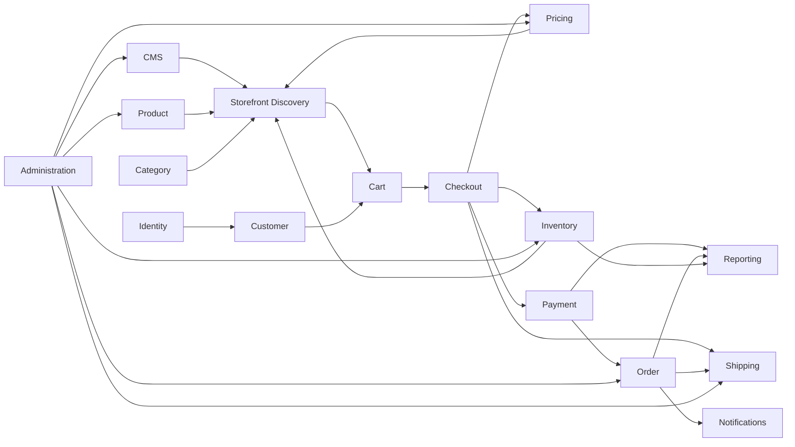

# PRODUCT.md

> **Release Status:** Version 1.0.0 establishes the approved product baseline for the Enterprise Fashion Commerce Platform. All business requirements, domain specifications, user-experience definitions, implementation plans, analytics, and operational procedures must conform to this document unless an approved product decision explicitly changes the baseline.

> Enterprise Fashion Commerce Platform — Authoritative Product Definition

This document defines the product vision, customer and business outcomes, actors, scope, capabilities, policies, success measures, and product decision principles for the Enterprise Fashion Commerce Platform. It must be read together with `.ai/core/AGENTS.md` and `.ai/core/ARCHITECTURE.md`.

`.ai/core/AGENTS.md` governs contributor behaviour. `.ai/core/ARCHITECTURE.md` governs the technical shape of the platform. This document governs what the product is intended to achieve and the business meaning of its capabilities.

## 1. Purpose and Authority

The purpose of this document is to provide one authoritative product baseline for business stakeholders, engineers, designers, quality specialists, operational users, and AI Agents.

It defines:

- The product vision and value proposition.
- The customer and operational problems being solved.
- The target actors and their needs.
- The product principles that guide decisions.
- The initial product scope and capability model.
- Business outcomes and measures of success.
- Cross-domain product policies.
- Explicit exclusions for Version 1.
- The relationship between product intent and detailed domain specifications.

The statements **must**, **must not**, **required**, and **prohibited** are mandatory product rules. The statements **should** and **should not** are strong defaults that may be overridden only through an approved product decision.

This document does not replace detailed requirements under `specifications/`. It establishes the product baseline that those specifications must implement consistently.

## 2. Product Vision

The Enterprise Fashion Commerce Platform will provide a premium, trustworthy, mobile-first online shopping experience for a fashion and streetwear business while giving authorised staff reliable control over products, categories, collections, media, pricing, promotions, inventory, customers, content, payments, orders, shipping, communications, administration, and reporting.

The platform must make shopping feel visually refined and simple without hiding important information or sacrificing correctness. Customers should be able to discover products, understand variants and availability, complete payment confidently, and track their purchases without unnecessary friction.

For the business, the platform must provide accurate operational control and a dependable record of commercial activity. Staff should be able to manage the store without direct database access, developer intervention, or reliance on undocumented manual processes for ordinary operations.

The product is not intended to copy another retailer’s identity or implementation. It may learn from established premium fashion-commerce patterns while developing its own brand, design system, domain model, customer experience, and operational capabilities.

## 3. Product Mission

The product mission is:

> Enable customers to discover and purchase premium fashion confidently while enabling the business to operate catalogue, stock, orders, payments, fulfilment, and content accurately from one coherent platform.

Every significant capability should contribute to at least one of the following:

1. Improve product discovery.
2. Increase customer confidence.
3. Reduce purchase friction.
4. Protect payment, stock, and order accuracy.
5. Improve operational efficiency.
6. Improve visibility into business performance.
7. Strengthen customer trust and supportability.
8. Enable safe future growth.

## 4. Product Value Proposition

### 4.1 Customer Value

Customers receive:

- A premium, responsive storefront designed for mobile and desktop.
- Clear product imagery, descriptions, prices, variants, and availability.
- Useful browsing, filtering, search, collection, and recommendation experiences.
- A persistent cart and straightforward checkout.
- Secure payment through approved providers.
- Clear confirmation and order-status communication.
- Account, address, wishlist, and order-history capabilities where applicable.
- Accessible interactions and understandable error recovery.
- Transparent delivery, returns, refund, and privacy information.

### 4.2 Business Value

The business receives:

- Centralised catalogue and merchandising control.
- Accurate variant-level stock visibility and movement history.
- Controlled pricing, sale, voucher, and promotion management.
- Reliable order, payment, refund, shipment, and communication records.
- Role-based administration and auditable staff actions.
- Customer and consent management.
- Content-management capabilities for campaigns and policies.
- Operational reporting and export capabilities.
- Replaceable provider integrations and an architecture that supports growth.

### 4.3 Engineering and Operational Value

The product foundation provides:

- Domain-based ownership of business rules.
- Traceable requirements and decisions.
- Consistent API, data, testing, security, and documentation standards.
- AI-assisted implementation governed by the repository Context Hierarchy.
- Observable workflows and reconciliation paths for critical operations.
- A modular evolution path without premature microservice complexity.

## 5. Product Principles

### 5.1 Trust Before Conversion

The platform must not pursue conversion by obscuring price, stock, delivery, return, consent, or payment information. Customer trust is a long-term product asset.

### 5.2 Mobile First, Not Mobile Only

Customer journeys must be designed first for constrained mobile viewports and touch interaction, then enhanced for larger displays. Desktop experiences must remain intentional rather than stretched mobile layouts.

### 5.3 Visual Quality with Functional Clarity

The platform should feel premium and fashion-led, but visual design must not reduce readability, accessibility, discoverability, or task completion.

### 5.4 Accurate Commercial Truth

Price, promotion, stock, payment, order, refund, and shipment information must be derived from authoritative domain state. The product must not present uncertain outcomes as confirmed.

### 5.5 Friction Where Risk Requires It

Low-risk actions should be efficient. Destructive, financial, security-sensitive, or irreversible actions must include appropriate validation, confirmation, authorization, and audit evidence.

### 5.6 Recoverable Customer Journeys

Where practical, customers must be able to recover from validation errors, provider failure, interrupted checkout, declined payment, expired sessions, and network interruption without re-entering unnecessary information.

### 5.7 Accessible by Default

Accessibility is part of the acceptance criteria for every customer-facing and administrative capability. The product must target WCAG 2.2 AA.

### 5.8 Operational Control Through the Product

Ordinary business operations must be supported through authorised product workflows. Direct production database modification must not be the normal way to manage products, stock, orders, customers, payments, or content.

### 5.9 Explicit Scope and Progressive Delivery

The product should deliver complete vertical capabilities in controlled phases. Large numbers of partial or placeholder features must not be represented as product completeness.

### 5.10 Evidence-Based Evolution

Enhancements should be guided by customer behaviour, operational pain, business outcomes, support evidence, reliability data, and cost rather than trend-driven complexity.

## 6. Target Market and Initial Operating Context

The initial product is intended for a South African fashion-commerce business selling owned or directly managed clothing and related fashion products through one primary online storefront.

The Version 1 operating context assumes:

- Primary market: South Africa.
- Primary language: English, with future localisation readiness and no Version 1 multilingual requirement.
- Primary currency: South African Rand (`ZAR`).
- Customer access through modern mobile and desktop web browsers.
- One primary legal merchant and commerce operation.
- One primary catalogue with variant-level stock.
- Physical product fulfilment through approved courier or shipping providers.
- Payment through approved hosted or tokenised payment providers.
- Administrative operation by authorised internal staff.

Any expansion into additional countries, currencies, languages, legal entities, sellers, warehouses, or tax jurisdictions requires explicit product and architectural review.

## 7. Product Actors

### 7.1 Visitor

A visitor is an unauthenticated customer who may:

- Browse products, categories, collections, and content.
- Search and filter the catalogue.
- View product details and availability.
- Add products to a guest cart.
- Begin guest checkout where enabled.
- Register or sign in.
- Review public policies and support information.

### 7.2 Registered Customer

A registered customer may additionally:

- Maintain profile details.
- Manage saved addresses.
- Maintain a wishlist.
- Access persistent cart behaviour.
- View order history and order details.
- Track eligible shipments.
- Manage communication and privacy preferences.
- Request supported account and order actions.

### 7.3 Store Administrator

A Store Administrator manages product and store operations according to assigned permissions. Capabilities may include:

- Catalogue and category management.
- Product publication.
- Pricing and promotions.
- Inventory operations.
- Order and fulfilment management.
- Customer support workflows.
- CMS and media management.
- Reporting and exports.
- Staff-user and role management where authorised.

### 7.4 Merchandiser or Content Editor

A merchandiser or content editor focuses on:

- Product information.
- Categories and collections.
- Product media.
- Homepage and campaign content.
- Search and navigation merchandising.
- Scheduled publication.

This role must not receive financial, security, or Staff User-administration permissions by default.

### 7.5 Inventory or Fulfilment Operator

This actor may:

- Review stock.
- Record approved stock adjustments.
- Process picking, packing, shipment, and delivery-related actions.
- Print or retrieve supported fulfilment documents.
- Investigate reservation and fulfilment exceptions.

### 7.6 Customer Support Agent

A support agent may:

- Locate customers and orders.
- Review non-sensitive payment and shipment status.
- Add internal notes.
- Trigger approved resend or support actions.
- Initiate authorised cancellation, return, or refund workflows.
- Escalate discrepancies.

Support access must be limited, auditable, and privacy-aware.

### 7.7 Finance or Operations User

This actor may access:

- Payment and refund records.
- Reconciliation information.
- Sales, tax, settlement, and operational exports.
- Approved financial-status corrections through controlled workflows.

### 7.8 Platform Administrator

A Platform Administrator manages staff accounts, roles, permissions, configuration, integrations, and high-risk operational capabilities. This is a privileged role and must be tightly controlled and audited.

### 7.9 External Provider

External providers include payment, shipping, notification, object-storage, analytics, and other approved services. Providers are not product authorities beyond the specific contract they own.

## 8. Customer Problems to Solve

The product must address the following customer problems:

### 8.1 Product Discovery

Customers may struggle to find relevant items when catalogue navigation, search, filtering, collections, or product information are unclear.

The platform must provide understandable hierarchy, useful search, relevant filters, curated collections, and consistent product presentation.

### 8.2 Purchase Confidence

Customers may abandon purchase when product imagery, fit, sizing, stock, price, delivery, returns, or payment information is uncertain.

The platform must present complete and consistent decision-support information before checkout.

### 8.3 Mobile Friction

Fashion customers commonly browse and purchase on mobile devices. Small controls, unstable layouts, slow media, lengthy forms, or difficult variant selection create avoidable abandonment.

The product must prioritise mobile usability and performance throughout the journey.

### 8.4 Checkout Failure

Customers may lose trust when checkout resets, totals change without explanation, payment fails unclearly, or an order outcome is uncertain.

The product must revalidate transparently, preserve recoverable input, provide clear payment state, and avoid duplicate charges or orders.

### 8.5 Post-Purchase Uncertainty

Customers need reliable confirmation, status, tracking, support, and refund visibility after purchase.

The product must maintain a coherent post-purchase journey even when providers update asynchronously.

### 8.6 Accessibility Barriers

Customers using assistive technologies, keyboards, zoom, reduced motion, or constrained devices must be able to complete critical journeys without exclusion.

## 9. Business Problems to Solve

### 9.1 Fragmented Catalogue Operations

Product data, imagery, categories, pricing, and publication must be managed through one controlled workflow with clear ownership and validation.

### 9.2 Inaccurate Stock

The business needs variant-level inventory truth, reservations, adjustments, movements, low-stock visibility, and reconciliation.

### 9.3 Weak Order and Payment Traceability

Staff need to understand the relationship between checkout, Payment Attempts, provider callbacks, orders, refunds, shipments, and notifications.

### 9.4 Manual Fulfilment Risk

Picking, packing, shipment creation, tracking, and status updates need controlled workflows and audit history.

### 9.5 Promotion Inconsistency

Discounts and vouchers require explicit eligibility, validity, usage, exclusions, and calculation rules.

### 9.6 Limited Operational Visibility

The business needs dashboards and reports for sales, orders, payments, refunds, stock, fulfilment, customers, and platform health.

### 9.7 Excessive Developer Dependency

Authorised staff should manage ordinary store operations without code changes or database access.

### 9.8 Provider Lock-In

The business must be able to replace or add payment, shipping, notification, storage, analytics, or search providers without rewriting core product rules.

## 10. Product Goals

The Version 1 product goals are:

1. Launch a complete customer storefront for browsing and purchasing fashion products.
2. Provide secure guest and registered-customer checkout capability.
3. Maintain authoritative variant-level product, price, inventory, payment, and order state.
4. Provide protected administration for ordinary store operations.
5. Support reliable fulfilment, shipment, notification, refund, and reconciliation workflows.
6. Meet agreed accessibility, performance, security, and observability standards.
7. Produce trustworthy operational and commercial reporting.
8. Establish an extensible foundation for future channels and capabilities.
9. Ensure every critical customer and operational journey has a defined recovery, support, and reconciliation path.

## 11. Non-Goals for Version 1

Version 1 does not aim to provide:

- A multi-seller marketplace.
- International multi-currency commerce.
- Multi-tenant SaaS operation.
- Native iOS or Android applications.
- Complex warehouse-management or manufacturing capability.
- Wholesale and business-to-business commerce.
- Subscription commerce.
- Customer loyalty points or stored-value wallets.
- Social commerce as a separate checkout channel.
- Real-time AI recommendations in the critical purchase path.
- Full omnichannel store inventory and collection.
- Automated returns logistics without an approved provider and process.
- Multiple legal merchants within one deployment.

- Automated dynamic pricing driven by machine learning.
- Customer-to-customer resale or peer marketplace capability.
- Physical point-of-sale integration.
- Same-day delivery as a guaranteed platform capability.

These exclusions prevent the initial product from carrying complexity that has not yet been justified. Future support requires formal product and architecture decisions.

## 12. Product Capability Map

### 12.1 Discovery and Merchandising

- Homepage and campaign content.
- Product catalogue.
- Categories and collections.
- Product detail pages.
- Search.
- Filters and sorting.
- Product recommendations where approved.
- Wishlist.
- Recently viewed items where approved.

### 12.2 Commerce

- Guest and customer cart.
- Variant and quantity selection.
- Promotion and voucher application.
- Checkout.
- Address capture and selection.
- Shipping method selection.
- Payment initiation.
- Order confirmation.

### 12.3 Customer Account

- Registration.
- Authentication.
- Profile.
- Address book.
- Wishlist.
- Order history.
- Order details and tracking.
- Preference and consent management.
- Password and session management.

### 12.4 Post-Purchase

- Transactional confirmation.
- Order-status updates.
- Shipment tracking.
- Cancellation eligibility.
- Return or refund request workflows where approved.
- Support contact and investigation.

### 12.5 Catalogue Administration

- Product and variant management.
- Categories and collections.
- Product media.
- Publication and scheduling.
- Search and SEO metadata.
- Bulk operations where safe.

### 12.6 Commercial Administration

- Price management.
- Sale pricing.
- Promotions.
- Vouchers.
- Usage and eligibility rules.

### 12.7 Inventory and Fulfilment Administration

- Stock visibility.
- Adjustments and movement history.
- Reservation visibility.
- Low-stock controls.
- Order fulfilment.
- Shipment creation.
- Tracking updates.

### 12.8 Customer and Support Administration

- Customer search and profile review.
- Order investigation.
- Internal notes.
- Resend and recovery actions.
- Controlled cancellation and refund initiation.

### 12.9 Platform Administration

- Staff users.
- Roles and permissions.
- Integration configuration.
- Audit logs.
- System health and operational controls.

### 12.10 Reporting

- Sales and order reporting.
- Payment and refund reporting.
- Inventory and stock-movement reporting.
- Customer reporting.
- Promotion reporting.
- Operational exports.

## 13. Product Domain Relationships

The product domains are distinct but cooperate to complete customer and operational journeys.



The diagram expresses collaboration, not shared ownership. Each domain remains authoritative for the state defined in `.ai/core/AGENTS.md` and `.ai/core/ARCHITECTURE.md`.

## 14. Customer Journey Baseline

### 14.1 Discover

A customer enters through the homepage, campaign, collection, category, search result, or direct product link.

The experience must support:

- Clear navigation.
- Useful merchandising.
- Fast and stable media loading.
- Search and filter recovery.
- Customer-visible product state only.

### 14.2 Evaluate

The customer reviews:

- Product imagery.
- Name and description.
- Price and sale state.
- Available variants.
- Size or fit guidance.
- Stock or availability information.
- Delivery and return information.
- Related or recommended products where approved.

### 14.3 Add to Cart

The customer selects a valid variant and quantity. The platform validates sellability and returns a clear cart state.

Cart price and availability remain provisional until checkout revalidation.

### 14.4 Checkout

The customer provides or selects:

- Contact information.
- Delivery address.
- Shipping method.
- Promotion or voucher where applicable.
- Payment method through the approved provider flow.

The platform must clearly communicate any price, stock, promotion, or delivery change before payment confirmation.

### 14.5 Payment

The customer completes payment through a hosted or tokenised provider experience.

The platform must not represent payment as successful until authoritative provider confirmation is validated by the backend.

### 14.6 Confirmation

After confirmed payment and successful order creation, the customer receives:

- A unique order reference.
- Order summary.
- Delivery details.
- Payment status.
- Next-step expectations.
- Access to order tracking or support where available.

### 14.7 Fulfilment and Delivery

The customer receives meaningful status updates without exposing internal operational complexity.

### 14.8 Support and Resolution

The customer can locate support information and provide an order reference. Authorised staff can investigate using correlated Payment Transaction, order, shipment, and notification records.

## 15. Administrative Journey Baseline

### 15.1 Catalogue Setup

An authorised Staff User creates product information, variants, categories, media, pricing, SEO information, and publication settings.

Publication must be blocked until mandatory information and sellability requirements are satisfied.

### 15.2 Inventory Operations

An authorised operator records stock through approved adjustment or receipt workflows with reason, actor, timestamp, and movement history.

### 15.3 Order Operations

An authorised Staff User reviews paid orders, processes fulfilment, creates shipments, records supported status transitions, and investigates exceptions.

### 15.4 Customer Support

A support user searches by approved identifiers, reviews the customer journey, and performs only permitted recovery actions.

### 15.5 Financial Operations

A finance or operations user reviews payment and refund state, identifies reconciliation discrepancies, and uses controlled repair or escalation workflows.

### 15.6 Content Operations

A content user prepares and schedules campaigns, homepage content, banners, and policy content without code deployment.

## 16. Cross-Cutting Product Policies

### 16.1 Pricing Policy

- Customer-visible prices must use `ZAR` in Version 1.
- Final checkout prices must be recalculated by the backend.
- Order items must retain immutable price and discount snapshots.
- Sale and promotion information must not be misleading.
- Client-provided totals must never be trusted.

### 16.2 Inventory Policy

- Inventory is authoritative at product-variant level.
- Available-to-sell quantity must account for approved reservations.
- Cart presence does not guarantee stock.
- Checkout confirmation must revalidate or reserve stock.
- Reservation expiry and release must be explicit.
- Staff adjustments require reason and audit history.

### 16.3 Payment Policy

- Raw card data must not be stored by the platform.
- Provider callbacks (Webhooks) must be validated, authenticated where supported, and processed idempotently.
- Browser redirects must never be treated as authoritative payment confirmation.
- Payment Attempts, Payment Transactions, and Refunds must remain independently traceable.
- Uncertain payment state must be reconciled before final financial representation.

### 16.4 Order Policy

- An Order is the durable commercial record created from Checkout that captures the Customer, Order Items, price, tax, discount, Payment state, Fulfilment state, and delivery details.
- Confirmed order items, addresses, prices, discounts, and totals must be snapshots.
- Order status transitions must be controlled and historical.
- Ordinary deletion of confirmed orders is prohibited.
- Payment, fulfilment, and cancellation status must remain distinguishable.

### 16.5 Shipping Policy

- Delivery options must reflect current supported service rules.
- Quotes may expire and must be revalidated when required.
- Shipment and tracking state must remain provider-reconcilable.
- Failure to send a notification must not change shipment truth.

### 16.6 Promotion Policy

Promotions must define:

- Validity period.
- Customer eligibility.
- Product or category eligibility.
- Minimum or maximum thresholds.
- Usage limits.
- Stackability.
- Exclusions.
- Calculation order.
- Refund treatment.

### 16.7 Customer and Privacy Policy

- Personal information must be collected only for a defined purpose.
- Consent and transactional necessity must remain distinguishable.
- Marketing consent must not be assumed from purchase.
- Customer account changes must not alter historical order snapshots.
- Access to customer information must be permission-controlled and auditable.

### 16.8 Content Policy

- Public policy content must be versionable and publishable.
- Product and campaign content must not make unsupported claims.
- Draft content must not be visible publicly.
- Media must meet quality, rights, security, and accessibility requirements.

### 16.9 Accessibility Policy

Critical journeys must be operable through keyboard and compatible assistive technology. Product imagery, forms, validation, navigation, modals, checkout, account, and administration experiences must meet the approved accessibility standard.

### 16.10 Tax and Invoice Policy

- Version 1 customer-visible prices must follow the approved South African tax-display policy.
- Order and invoice records must preserve the tax values applicable at the time of confirmation.
- Tax, invoice numbering, and document requirements must be defined before production launch.
- Client-side calculations must not be authoritative for tax or invoice totals.

### 16.11 Returns and Refund Policy

- Returns, exchanges, cancellations, and refunds must use explicit eligibility and lifecycle rules.
- Customer-facing policy content must match operational capability.
- Refund approval, provider processing, order financial state, inventory disposition, and customer communication must remain distinguishable.
- Manual exceptions require permission, reason, audit evidence, and reconciliation.

### 16.12 Fraud and Abuse Policy

- The platform must protect registration, authentication, vouchers, promotions, checkout, payment, refund, and administrative workflows from foreseeable abuse.
- Fraud controls must not silently alter authoritative order or payment state.
- High-risk actions may require additional verification, review, rate limiting, or operational approval.
- Fraud signals and decisions must follow privacy, security, audit, and explainability requirements.

## 17. Product State Principles

### 17.1 Explicit Lifecycle State

Products, variants, carts, checkout sessions, payments, orders, refunds, shipments, promotions, content, and notifications must use explicit lifecycle states where behaviour depends on current status. Each lifecycle must use only the canonical states defined for that domain in `.ai/core/GLOSSARY.md`; lifecycle states must not be generalised across unrelated domains.

### 17.2 No Ambiguous Success

The product must distinguish states such as:

- Initiated.
- Pending Payment.
- Processing.
- Confirmed.
- Fulfilled.
- Cancelled.
- Completed.
- Archived.
- Failed.
- Expired.
- Refunded.
- Partially Refunded.
- Reconciliation Required.

A Pending Payment or uncertain state must not be displayed as complete.

### 17.3 State Transition Ownership

Only the owning domain may authoritatively transition its state. Administration and support interfaces request transitions through approved use cases.

### 17.4 State History

Critical commercial and operational transitions must retain history sufficient for support, audit, reconciliation, and reporting.

## 18. Product Success Measures

Formal targets will be defined in business specifications and analytics plans. The product must support measurement of at least the following.

### 18.1 Customer Journey Measures

- Product-listing engagement.
- Search usage and zero-result rate.
- Product-detail engagement.
- Add-to-cart rate.
- Cart-to-checkout rate.
- Checkout completion rate.
- Payment success, decline, cancellation, and uncertainty rate.
- Purchase conversion rate.
- Repeat-purchase rate.
- Wishlist usage.
- Customer support contact rate by journey stage.

### 18.2 Commercial Measures

- Gross Revenue and Net Revenue.
- Average Order Value.
- Units per order.
- Discount and promotion impact.
- Refund and cancellation rate.
- Product, category, and collection performance.
- Inventory sell-through.
- Stock-out impact.

### 18.3 Operational Measures

- Order-to-fulfilment time.
- Shipment creation success.
- Delivery-status freshness.
- Notification delivery success.
- Payment reconciliation exceptions.
- Inventory discrepancies.
- Support resolution time.
- Administrative error rate.

### 18.4 Quality Measures

- Core Web Vitals.
- Accessibility conformance.
- API availability and latency.
- Checkout and payment error rate.
- Production defect rate.
- Mean time to detect and restore.
- Security findings and remediation time.

### 18.5 Measurement Integrity

Analytics must be consent-aware and must not become the authoritative source for commercial truth. Orders, payments, refunds, and inventory remain authoritative in their owning domains.

### 18.6 Guardrail Measures

Product optimisation must monitor guardrails including:

- Accessibility failures.
- Payment duplication or uncertain-payment rate.
- Inventory oversell or reservation discrepancies.
- Refund and cancellation complaints.
- Support-contact volume caused by product changes.
- Page and API performance regressions.
- Security, privacy, and consent incidents.
- Promotion misuse or unexpected margin impact.

An improvement in conversion or engagement must not be considered successful when a material guardrail worsens beyond the approved tolerance.

## 19. Assumptions

The Version 1 baseline assumes:

- The merchant owns or directly controls the products sold.
- Product availability is managed at variant level.
- The initial operation uses one primary currency and market.
- Tax treatment can be represented within the selected pricing and order model.
- Payment is delegated to an approved provider.
- Shipping is fulfilled through one or more approved courier integrations or controlled manual processes.
- Staff roles and operational responsibilities can be represented through RBAC.
- Product media can be stored and delivered through approved Azure capabilities.
- A modular monolith is sufficient for initial product scale.

Assumptions must be validated in detailed business and domain specifications. An invalidated assumption may require product and architecture change control.

## 20. Constraints

The product is constrained by:

- South African commercial, privacy, consumer, tax, and payment requirements as applicable.
- Provider contracts, service availability, and integration capabilities.
- Azure service cost and available project budget.
- A small engineering and operational team.
- The need to release progressively without sacrificing critical correctness.
- Mobile bandwidth and device variability.
- Accessibility and security requirements.
- Data-retention and audit requirements.

This document does not provide legal or tax interpretation. Applicable obligations must be validated by qualified stakeholders before production launch.

## 21. Product Decision Hierarchy

When product guidance conflicts, apply this order:

1. Applicable legal, regulatory, contractual, privacy, and security obligations.
2. Approved business policy and customer commitments.
3. This product baseline.
4. Accepted product or architecture decisions.
5. Detailed business and domain specifications.
6. Approved UX and design-system standards.
7. Existing product behaviour that remains consistent with higher authority.
8. Stakeholder or contributor preference.

A lower-authority source must not silently override a higher-authority source.

## 22. Requirements Traceability

Every material product requirement must be traceable through the delivery lifecycle.

The expected trace is:

```text
Business Outcome
      ↓
Product Requirement
      ↓
Domain, UX, or Operational Specification
      ↓
Architecture, API Contract, and Domain Specification
      ↓
Implementation
      ↓
Automated and Manual Verification
      ↓
Production Metric or Operational Evidence
```

Specifications should use stable requirement identifiers. Code, tests, APIs, diagrams, and acceptance evidence should reference those identifiers where this materially improves traceability.

## 23. Product Risks and Controls

| Product Risk                                                                              | Product Control                                                                                   |
| ----------------------------------------------------------------------------------------- | ------------------------------------------------------------------------------------------------- |
| Premium visual design reduces usability                                                   | Apply accessibility, responsive, content, and design-system standards to every journey.           |
| Customer sees stale or misleading price                                                   | Recalculate authoritative totals at checkout and preserve order snapshots.                        |
| Product appears available but cannot be purchased                                         | Centralise variant sellability and inventory rules, and revalidate before payment.                |
| Customer is charged without a clear order outcome                                         | Use authoritative payment confirmation, idempotency, order creation controls, and reconciliation. |
| Duplicate Webhook notifications create duplicate Payment Transactions or Order processing | Deduplicate callbacks and make critical handlers idempotent.                                      |
| Staff can bypass business rules                                                           | Route all administration through domain-owned use cases with RBAC and audit.                      |
| Promotions create unexpected losses                                                       | Define explicit eligibility, stacking, thresholds, limits, calculation order, and reporting.      |
| Customer support cannot diagnose issues                                                   | Correlate cart, checkout, payment, order, shipment, and notification records.                     |
| Accessibility is deferred                                                                 | Include accessibility acceptance criteria and quality gates in every UI capability.               |
| Scope expands before core journeys are reliable                                           | Use explicit Version 1 goals, non-goals, and phased delivery.                                     |
| Analytics conflicts with commercial records                                               | Treat analytics as a behavioural projection, not transactional truth.                             |
| Operational workflows depend on developers                                                | Provide secure administration, repair, reconciliation, and reporting capabilities.                |

## 24. Open Product Decisions

The following decisions require detailed business specification or approved product decision before implementation becomes binding:

1. Final brand name and visual identity.
2. Initial product categories and catalogue taxonomy.
3. Size, fit, colour, material, and other variant or attribute standards.
4. Guest checkout versus mandatory account rules.
5. Customer email-verification requirements.
6. Initial payment methods and provider.
7. Shipping provider, service levels, delivery areas, and fee policy.
8. Free-delivery threshold and promotional treatment.
9. Tax-inclusive display and invoice requirements.
10. Cancellation eligibility and cutoff policy.
11. Returns, exchanges, and refund policy.
12. Inventory reservation duration.
13. Back-order and pre-order support.
14. Voucher and promotion stacking policy.
15. Product-review support.
16. Wishlist behaviour for guest and registered customers.
17. Low-stock and out-of-stock customer messaging.
18. Customer-support channels and service expectations.
19. Marketing-consent and communication-preference model.
20. Initial analytics provider and event taxonomy.
21. Initial reporting and export requirements.
22. Content approval and scheduled-publication workflow.
23. Administrative role and permission matrix.
24. Production customer-service and operational escalation process.
25. South African tax-display, invoice, and credit-note policy.
26. Fraud-screening approach and manual-review workflow.
27. Product data import, export, and migration requirements.
28. Customer data export, correction, deletion, and account-closure workflow.
29. Gift cards, store credit, and promotional credit policy.
30. Product launch date, release scope, and post-launch support window.

An open decision must not be resolved differently by separate features. Until approved, implementation must remain reversible and avoid embedding assumptions as permanent business rules.

## 25. Product Operating Model

The product operating model defines how product decisions move from business need to implemented and measurable capability.

### 25.1 Product Ownership

Product and Engineering jointly own the product baseline. Detailed ownership is distributed as follows:

| Area                              | Primary Owner              | Required Contributors                        |
| --------------------------------- | -------------------------- | -------------------------------------------- |
| Product vision and outcomes       | Product                    | Engineering, Design, Operations, Finance     |
| Customer journeys                 | Product and UX             | Engineering, Accessibility, Support          |
| Domain rules                      | Product and Domain Owner   | Engineering, QA, Operations                  |
| Commercial policy                 | Product and Business Owner | Finance, Operations, Legal where required    |
| Security and privacy requirements | Security and Product       | Engineering, Legal/Compliance where required |
| Operational workflows             | Operations                 | Product, Engineering, Support                |
| Technical implementation          | Engineering                | Product, QA, Security, Operations            |
| Measurement and reporting         | Product and Data           | Engineering, Finance, Operations             |

No single contributor may redefine a cross-domain business rule without the required owners.

### 25.2 Product Decision Records

A documented product decision is required when a choice:

- Changes customer eligibility or access.
- Changes price, promotion, delivery, cancellation, return, or refund policy.
- Changes the meaning of an order, payment, inventory, or customer state.
- Introduces a new actor or permission boundary.
- Creates a material analytics or consent implication.
- Changes a Version 1 goal or non-goal.
- Is expensive to reverse or likely to affect multiple specifications.

Product decisions must record Context, Decision, alternatives, consequences, owner, date, and affected Requirements.

### 25.3 Product Review Rhythm

The product baseline should be reviewed:

- Monthly during active development.
- Before each major release.
- After significant production incidents.
- After major changes to providers, policy, market, or operating model.
- When product evidence invalidates an assumption.

### 25.4 Product Change Control

A material product change requires:

1. A clear problem statement.
2. Evidence or business rationale.
3. Scope and impact analysis.
4. Identification of affected domains and actors.
5. Updated acceptance criteria and success measures.
6. Security, privacy, accessibility, operational, and support review.
7. Updated specifications and traceability.

## 26. Product Requirement Model

Requirements must be structured so that they are understandable, testable, and traceable.

### 26.1 Requirement Types

| Type                       | Purpose                                                                                                   |
| -------------------------- | --------------------------------------------------------------------------------------------------------- |
| Business Requirement       | Defines the business outcome or policy the product must support.                                          |
| Actor Requirement          | Defines what an actor must be able to achieve.                                                            |
| Functional Requirement     | Defines observable system behaviour.                                                                      |
| Business Rule              | Defines mandatory domain logic, eligibility, calculation, or state constraint.                            |
| Non-Functional Requirement | Defines quality expectations such as security, accessibility, performance, reliability, and auditability. |
| Data Requirement           | Defines authoritative data, ownership, retention, history, and reporting needs.                           |
| Integration Requirement    | Defines provider or external-system interaction.                                                          |
| Operational Requirement    | Defines administration, support, reconciliation, monitoring, and recovery capability.                     |
| Compliance Requirement     | Defines an applicable legal, regulatory, contractual, or policy obligation.                               |
| Analytics Requirement      | Defines approved events, measures, attribution, and consent boundaries.                                   |

### 26.2 Requirement Structure

Every material requirement should include:

- Stable identifier.
- Title.
- Type.
- Owner.
- Rationale.
- Actors.
- Preconditions.
- Trigger.
- Required behaviour.
- Business rules.
- Success outcome.
- Failure and recovery behaviour.
- Security, privacy, accessibility, performance, and observability implications.
- Acceptance criteria.
- Dependencies.
- Open decisions.

### 26.3 Requirement Language

Requirements must:

- Describe outcomes rather than implementation detail unless the implementation is itself a constraint.
- Use one clear obligation per requirement where practical.
- Avoid vague terms such as “fast”, “easy”, “user-friendly”, or “secure” without measurable criteria.
- Distinguish mandatory behaviour from optional enhancement.
- Avoid embedding unresolved assumptions as facts.

### 26.4 Acceptance Criteria

Acceptance criteria must cover, where applicable:

- Happy path.
- Empty state.
- Loading state.
- Validation failure.
- Business-rule rejection.
- Permission failure.
- Provider failure.
- Retry and resume.
- Cancellation.
- Concurrency conflict.
- Accessibility behaviour.
- Mobile and responsive behaviour.
- Audit and telemetry evidence.

## 27. Product Prioritisation Framework

Prioritisation must balance customer value, business value, risk, dependency, effort, and operational readiness.

### 27.1 Priority Classes

| Priority         | Meaning                                                                                                      |
| ---------------- | ------------------------------------------------------------------------------------------------------------ |
| P0 — Mandatory   | Required for legal, security, data-integrity, payment, order, or launch viability.                           |
| P1 — Core        | Required for a complete Version 1 customer or operational journey.                                           |
| P2 — Important   | Materially improves conversion, efficiency, supportability, or insight but is not required for first launch. |
| P3 — Enhancement | Valuable optimisation or differentiation after core journeys are stable.                                     |
| P4 — Exploration | Hypothesis, experiment, or future opportunity requiring validation.                                          |

### 27.2 Prioritisation Criteria

Each item should be assessed against:

- Customer impact.
- Revenue or commercial impact.
- Operational impact.
- Risk reduction.
- Legal, security, privacy, or accessibility obligation.
- Dependency on or enablement of other capabilities.
- Implementation and support cost.
- Confidence in the problem and expected outcome.
- Reversibility.

### 27.3 Priority Guardrails

The following must not be deprioritised below capabilities they protect:

- Payment and order correctness.
- Inventory integrity.
- Authentication and authorization.
- Accessibility of critical journeys.
- Privacy and consent controls.
- Reconciliation and supportability.
- Backup, restore, and production observability.

### 27.4 Scope Trade-Offs

When time or budget is constrained, the preferred trade-off order is:

1. Remove optional variants or enhancements.
2. Reduce channel or provider breadth.
3. Reduce automation while preserving safe controlled operations.
4. Delay reporting depth while preserving transactional truth.
5. Delay visual embellishment while preserving usability and brand coherence.

Correctness, security, accessibility, and recoverability must not be traded away for feature volume.

## 28. Version 1 Delivery Phases

Version 1 should be delivered as complete vertical phases. Phase boundaries may be refined by roadmap decisions, but the dependency order must remain coherent.

### 28.1 Phase A — Foundation

Includes:

- Repository and AI context.
- Architecture and standards.
- Design system foundation.
- Authentication baseline.
- Environment, CI/CD, observability, and security foundations.
- Core database and migration capability.
- Approved provider integration patterns.

Exit criteria:

- Development and deployment environments are reproducible.
- Quality gates are active.
- Core architectural boundaries are enforceable.

### 28.2 Phase B — Catalogue and Discovery

Includes:

- Product and variant management.
- Category and collection management.
- Product media.
- Pricing display.
- Inventory availability display.
- Homepage, listing, product detail, search, filtering, and navigation.
- Catalogue administration.

Exit criteria:

- Customers can discover complete, published, sellable products.
- Staff can create and publish products without developer intervention.

### 28.3 Phase C — Cart, Customer, and Checkout

Includes:

- Guest and registered carts.
- Registration and sign-in.
- Customer profile and addresses.
- Checkout validation.
- Shipping-option selection.
- Promotion and voucher handling.
- Payment initiation.

Exit criteria:

- A customer can progress from product discovery to an approved payment flow.
- Price and stock are authoritatively revalidated.

### 28.4 Phase D — Payment, Order, and Confirmation

Includes:

- Provider callback handling.
- Idempotent payment state.
- Order creation.
- Immutable order snapshots.
- Confirmation experience.
- Transactional notifications.
- Payment and order administration.

Exit criteria:

- Successful payment produces exactly one correct order.
- Uncertain outcomes are reconcilable.

### 28.5 Phase E — Fulfilment, Shipping, and Support

Includes:

- Picking and packing workflows.
- Shipment creation.
- Tracking.
- Order-status updates.
- Cancellation, refund, and support workflows.
- Customer order history and tracking.

Exit criteria:

- Staff can fulfil and support confirmed orders through controlled workflows.

### 28.6 Phase F — Reporting and Launch Readiness

Includes:

- Commercial and operational reporting.
- Reconciliation dashboards.
- Accessibility validation.
- Performance validation.
- Security review.
- Backup and restore validation.
- Runbooks and support readiness.
- Production launch controls.

Exit criteria:

- The platform meets approved launch criteria across product, engineering, security, operations, and support.

## 29. Storefront Information Architecture

The storefront information architecture must remain understandable, scalable, and aligned with customer discovery behaviour.

### 29.1 Primary Navigation

Primary navigation should support:

- Home.
- New arrivals.
- Categories.
- Collections or campaigns.
- Sale where applicable.
- Search.
- Account.
- Wishlist.
- Cart.

Navigation labels must be customer-friendly and must not expose internal catalogue terminology.

### 29.2 Core Storefront Pages

| Page               | Primary Purpose                                                                            |
| ------------------ | ------------------------------------------------------------------------------------------ |
| Homepage           | Communicate brand, campaigns, featured collections, and high-priority discovery paths.     |
| Product Listing    | Present products for a category, collection, search, or campaign with filters and sorting. |
| Product Detail     | Support confident evaluation and variant selection.                                        |
| Search             | Help customers find relevant products and recover from poor or zero-result queries.        |
| Wishlist           | Preserve customer interest for later consideration.                                        |
| Cart               | Summarise purchase intent and prepare the customer for checkout.                           |
| Checkout           | Capture delivery and payment information with minimal friction and strong validation.      |
| Order Confirmation | Confirm the commercial outcome and next steps.                                             |
| Customer Account   | Provide profile, address, preference, wishlist, and order access.                          |
| Order Detail       | Present authoritative order, payment, fulfilment, shipment, and support information.       |
| Content Page       | Present policies, editorial content, support, and brand information.                       |

### 29.3 URL Principles

Public URLs should be:

- Human-readable.
- Stable.
- Lowercase.
- Hyphen-separated.
- Canonical.
- Independent of internal database identifiers where practical.
- Consistent with the repository API path naming rules defined in GLOSSARY.md.

### 29.4 Navigation State

The product should preserve useful navigation context such as filters, sorting, pagination, and scroll position when customers return from product detail to a listing.

## 30. Storefront Experience Standards

### 30.1 Product Listing

A listing must provide:

- Clear page context.
- Product count where useful.
- Relevant filters.
- Sort options.
- Accessible product cards.
- Stable image aspect ratios.
- Price and sale presentation.
- Availability messaging where approved.
- Loading, empty, error, and retry states.

### 30.2 Product Detail

A product detail experience must provide:

- Product name.
- Price and sale state.
- Image gallery.
- Variant selection.
- Size or fit guidance where applicable.
- Availability.
- Product description and material/care information where applicable.
- Delivery and return summary.
- Add-to-cart action.
- Clear validation when required selections are missing.
- Related or recommended products where approved.

### 30.3 Cart

The cart must provide:

- Product and variant summary.
- Quantity controls.
- Price summary.
- Promotion or voucher entry where applicable.
- Stock and price-change feedback.
- Remove and recovery behaviour.
- Checkout action.
- Delivery or threshold messaging where approved.

### 30.4 Checkout

Checkout must:

- Minimise unnecessary fields.
- Preserve valid input after recoverable failure.
- Distinguish contact, address, shipping, promotion, payment, and review concerns.
- Explain price or availability changes.
- Prevent duplicate submission.
- Provide accessible validation and focus management.
- Clearly communicate pending, failed, cancelled, and successful payment states.

### 30.5 Account

Account experiences must provide clear ownership and privacy controls without becoming a barrier to purchase.

## 31. Administration Information Architecture

Administration must be organised around operational tasks rather than database entities alone.

### 31.1 Primary Administration Areas

- Dashboard.
- Catalogue.
- Categories and collections.
- Media.
- Pricing and promotions.
- Inventory.
- Orders.
- Payments and refunds.
- Shipping and fulfilment.
- Customers and support.
- CMS.
- Reports and exports.
- Staff Users, Roles, and Permissions.
- Audit and system health.

### 31.2 Administration Design Principles

Administration must:

- Be permission-aware.
- Make environment and high-risk context visible.
- Prefer task-oriented workflows.
- Protect destructive and financial actions.
- Provide filters, search, pagination, and export where operationally necessary.
- Preserve audit evidence.
- Avoid exposing raw provider or database complexity unless required for support.

### 31.3 Bulk Operations

Bulk operations require:

- Explicit scope preview.
- Permission checks.
- Validation before execution.
- Progress and result reporting.
- Partial-failure handling.
- Audit history.
- Safe retry behaviour.

### 31.4 Administrative Repair

Repair workflows must be purpose-built, permission-controlled, auditable, and constrained by domain rules. Generic direct record editing is prohibited for critical commercial state.

## 32. Product Content Strategy

### 32.1 Content Types

The product may manage:

- Product content.
- Category and collection content.
- Homepage sections.
- Campaign landing pages.
- Banners.
- Editorial pages.
- Support content.
- Delivery, return, refund, privacy, and terms content.
- Transactional notification templates.

### 32.2 Content Lifecycle

Content must support explicit lifecycle states such as draft, review, scheduled, published, expired, and archived where applicable.

### 32.3 Content Quality

Content must be:

- Accurate.
- Brand-consistent.
- Accessible.
- Free of unsupported claims.
- Appropriate for mobile layouts.
- Search-friendly where public.
- Reviewed by the correct owner.

### 32.4 Product Content Minimums

A product must not be publishable without the minimum approved information required for customer understanding and purchase confidence.

The exact field requirements belong in the Product domain specification.

### 32.5 Policy Content

Policy content that affects customer rights, obligations, delivery, cancellation, returns, refunds, privacy, or payment must be versioned and approved before publication.

## 33. Analytics and Measurement Model

### 33.1 Measurement Principles

Analytics must:

- Serve a defined product or business question.
- Respect consent and privacy requirements.
- Avoid unnecessary personal information.
- Use stable Analytics Event names and properties.
- Remain distinct from authoritative transactional records.
- Be testable in non-production environments.

### 33.2 Analytics Event Categories

The product should support approved Analytics Events for:

- Page and content views.
- Search and filter usage.
- Product impressions and selections.
- Wishlist actions.
- Cart actions.
- Checkout progression.
- Promotion application.
- Payment initiation and outcome.
- Order confirmation.
- Account and support interactions.
- Administration workflow outcomes where operationally useful.

### 33.3 Analytics Event Quality

Every Analytics Event must define:

- Business purpose.
- Trigger.
- Actor context.
- Required properties.
- Prohibited properties.
- Consent basis.
- Deduplication behaviour.
- Owner.
- Retention or downstream use where relevant.

### 33.4 Experimentation

Experiments require:

- A hypothesis.
- Success and guardrail measures.
- Defined audience.
- Duration or stopping rule.
- Accessibility and ethics review where relevant.
- Feature-flag removal plan.

Experiments must not weaken security, privacy, pricing accuracy, payment integrity, or accessibility.

## 34. Customer Support and Service Model

### 34.1 Support Principles

Support must be able to understand the customer journey without exposing unnecessary sensitive data or relying on direct database inspection.

### 34.2 Support Context

Authorised support users should be able to correlate:

- Customer.
- Cart or checkout session where permitted.
- Payment attempt.
- Order.
- Refund.
- Shipment.
- Notification.
- Relevant audit events.

### 34.3 Support Actions

Supported actions may include:

- Resend confirmation.
- Review payment state.
- Review shipment state.
- Add internal notes.
- Initiate approved cancellation or refund workflows.
- Escalate reconciliation.
- Correct approved customer-facing information through domain workflows.

### 34.4 Service Expectations

Detailed support channels, hours, response targets, escalation levels, and customer communication templates must be defined before launch.

### 34.5 Support Safety

Support tools must:

- Enforce least privilege.
- Mask sensitive data.
- Record high-risk actions.
- Require confirmation for financial or destructive operations.
- Avoid arbitrary state manipulation.

## 35. Product Readiness Gates

A capability must pass the applicable product readiness gates before release.

### 35.1 Problem and Scope Gate

- The problem is validated.
- The intended actor and outcome are clear.
- Scope and exclusions are explicit.
- Dependencies and assumptions are identified.

### 35.2 Experience Gate

- Customer and administration journeys are defined.
- Mobile, desktop, loading, empty, failure, retry, and recovery states are specified.
- Accessibility criteria are included.
- Content requirements are complete.

### 35.3 Business Rule Gate

- Eligibility, calculations, lifecycle states, permissions, and policy rules are explicit.
- Authoritative domain ownership is identified.
- Historical and audit requirements are defined.

### 35.4 Operational Gate

- Staff workflows are defined.
- Support and reconciliation are possible.
- Reporting and monitoring requirements are known.
- Manual fallback is documented where required.

### 35.5 Launch Gate

- Acceptance criteria pass.
- Critical metrics are instrumented.
- Customer and support content is ready.
- Legal, policy, security, privacy, accessibility, and operational reviews are complete where applicable.
- Rollout and rollback plans exist.

## 36. Product Governance

### 36.1 Ownership

Product and Engineering jointly own this document. Material policy, scope, actor, market, or operating-model changes require review by the affected business and technical owners.

### 36.2 Source of Truth

This document is the product baseline. Detailed specifications may add precision but must not contradict its approved scope, principles, policies, actors, or domain ownership.

### 36.3 Product Drift

Product drift occurs when implemented behaviour no longer matches approved product intent. Drift must be recorded and resolved through either:

- Correction of implementation.
- Correction of specification.
- Approval of a changed product decision.

Undocumented production behaviour must not silently become the product definition.

### 36.4 Versioning

Backward-compatible clarifications should use minor versions. A major version is required when the product baseline changes materially, such as expansion to additional markets, merchants, currencies, sellers, channels, or fundamentally different commercial models.

## 37. Product Evolution Rules

### 37.1 Additive Evolution

New capabilities should extend the approved product model without weakening existing customer commitments, commercial truth, accessibility, privacy, security, or operational support.

### 37.2 New Market or Commercial Model

Expansion into another country, currency, language, legal merchant, seller model, business-to-business channel, subscription model, physical-store channel, or marketplace model requires:

1. Product impact assessment.
2. Legal, tax, privacy, payment, shipping, and support review.
3. Architecture impact assessment.
4. Updated domain ownership and data requirements.
5. Migration and rollout strategy.
6. A major product-baseline version when the operating model changes materially.

### 37.3 Provider Evolution

A provider change must preserve product semantics. Customers and staff should not experience External System-specific terminology or behaviour unless it is meaningful and intentionally designed.

### 37.4 Capability Retirement

Retiring a capability requires:

- Usage and dependency analysis.
- Customer and operational impact assessment.
- Data-retention and historical-access plan.
- Communication and migration guidance.
- Removal of obsolete documentation, analytics, permissions, configuration, and support procedures.

### 37.5 Experimental Capabilities

Experimental features must be clearly bounded, measurable, reversible, and protected by approved feature-flag and consent practices. An experiment must not become a permanent feature without product review.

## 38. Product Approval Workflow

### 38.1 Approval Levels

The required approval level depends on impact:

| Change Type                                                   | Minimum Approval                                                                           |
| ------------------------------------------------------------- | ------------------------------------------------------------------------------------------ |
| Copy, layout, or low-risk UX clarification                    | Product or delegated UX owner                                                              |
| Feature behaviour within an approved domain specification     | Product owner and domain owner                                                             |
| Cross-domain business rule or lifecycle change                | Product, affected domain owners, and Engineering                                           |
| Price, promotion, tax, cancellation, return, or refund policy | Product and accountable business owner, with Finance or Legal review where required        |
| Authentication, privacy, consent, or permission change        | Product, Engineering, Security, and Privacy/Legal where required                           |
| New provider or major operating-model change                  | Product, Engineering, Operations, Security, Finance, and relevant accountable stakeholders |
| Version 1 scope or non-goal change                            | Product and Engineering governance approval                                                |

### 38.2 Approval Evidence

Approval must be discoverable in the repository through one or more of:

- Approved specification.
- Product Decision Record.
- ADR.
- Pull-request approval.
- Linked issue or governance record.

Private chat, verbal agreement, or undocumented implementation does not constitute durable approval.

### 38.3 Emergency Product Changes

Urgent changes required to protect customers, data, payments, orders, security, or legal obligations may use an expedited approval path. The decision, scope, risk, owner, and follow-up documentation must be recorded promptly.

## 39. Product Compliance Matrix

| Product Concern               | Governing Source                               | Primary Evidence                                           |
| ----------------------------- | ---------------------------------------------- | ---------------------------------------------------------- |
| Contributor Behaviour         | `.ai/core/AGENTS.md`                           | Review and repository quality gates                        |
| Technical Architecture        | `.ai/core/ARCHITECTURE.md`                     | ADRs, architecture tests, implementation review            |
| Product Baseline              | `.ai/core/PRODUCT.md`                          | Approved requirements and product decisions                |
| Canonical Terminology         | `.ai/core/GLOSSARY.md`                         | Repository-wide terminology governance                     |
| Business Requirements         | `specifications/business/`                     | Requirement identifiers and acceptance criteria            |
| Domain Behaviour              | `specifications/domains/`                      | Domain rules, state models, tests, and traceability        |
| Frontend Experience           | `specifications/frontend/` and `.ai/frontend/` | UX specifications, component tests, accessibility evidence |
| Backend Behaviour             | `specifications/backend/` and `.ai/backend/`   | API contracts, integration tests, and operational evidence |
| Infrastructure and Operations | `specifications/infrastructure/`               | IaC, runbooks, monitoring, backup, and recovery evidence   |
| Security and Privacy          | `.ai/core/SECURITY-STANDARDS.md`               | Threat review, controls, scans, and audit evidence         |
| Testing                       | `.ai/core/TESTING-STANDARDS.md`                | Automated and manual verification                          |
| Documentation                 | `.ai/core/DOCUMENTATION-STANDARDS.md`          | Versioned source-of-truth documentation                    |
| Design System                 | `.ai/core/DESIGN-SYSTEM.md`                    | Tokens, components, Storybook, and design review           |

A more detailed specification may add constraints but must not weaken this product baseline.

## Repository Terminology Alignment

This document has been reviewed against the canonical terminology in `.ai/core/GLOSSARY.md` and must use glossary-defined terms without redefining them.

## 40. Authoritative Product Baseline

Version 1.0.0 is the approved product baseline for initial implementation and launch planning.

The baseline consists of:

- Product vision and mission.
- Target market and actors.
- Product principles.
- Version 1 goals and non-goals.
- Capability map.
- Customer and administrative journeys.
- Cross-cutting product policies.
- Product operating, prioritisation, support, analytics, content, readiness, and governance models.

Detailed specifications must make this baseline implementation-ready. They must not redefine it independently.

When implementation, documentation, analytics, or operational practice conflicts with this baseline, the conflict must be resolved through product change control rather than accepted as undocumented behaviour.

## 41. Product Self-Review Checklist

Before approving a product requirement or feature scope, verify:

- [ ] The customer or business problem is explicit.
- [ ] The intended outcome and success measure are defined.
- [ ] Actors and permissions are identified.
- [ ] In-scope and out-of-scope behaviour are clear.
- [ ] Business rules and lifecycle states are explicit.
- [ ] Success, empty, loading, validation, failure, retry, cancellation, and recovery states are considered.
- [ ] Price, inventory, payment, order, shipping, privacy, and support impacts are addressed where relevant.
- [ ] Tax, invoice, returns, refunds, fraud, and abuse implications are addressed where relevant.
- [ ] Product analytics include guardrails as well as success measures.
- [ ] Approval evidence and accountable owners are identified.
- [ ] Evolution, migration, retirement, and support impacts are considered.
- [ ] Accessibility and mobile behaviour are acceptance criteria.
- [ ] Security, fraud, abuse, and operational risks are considered.
- [ ] Analytics and reporting requirements do not replace transactional truth.
- [ ] The feature can be supported through authorised operational workflows.
- [ ] Requirements are traceable and testable.
- [ ] Open decisions are identified rather than hidden as assumptions.
- [ ] The scope is complete enough to deliver a usable vertical capability.
- [ ] The proposal remains consistent with `.ai/core/AGENTS.md` and `.ai/core/ARCHITECTURE.md`.

## Revision History

| Version | Date       | Status   | Summary                                                                                                                                                                                                                                                                 |
| ------- | ---------- | -------- | ----------------------------------------------------------------------------------------------------------------------------------------------------------------------------------------------------------------------------------------------------------------------- |
| 0.1.0   | 2026-08-05 | Draft    | Established the product vision, mission, value proposition, actors, customer and business problems, product principles, Version 1 goals and exclusions, capability map, journey baselines, cross-cutting policies, success measures, risks, and open product decisions. |
| 0.2.0   | 2026-08-05 | Draft    | Added the product operating model, requirement and prioritisation frameworks, phased Version 1 delivery, storefront and administration information architecture, experience standards, content, analytics, support, readiness gates, and product governance.            |
| 1.0.0   | 2026-08-05 | Approved | Released the authoritative product baseline after finalising cross-cutting policies, guardrail measures, evolution rules, approval workflow, compliance mapping, governance, and Version 1 launch scope.                                                                |
| 1.0.1   | 2026-08-05 | Approved | Repository terminology audit completed to align PRODUCT.md with the canonical GLOSSARY.md without changing approved product intent.                                                                                                                                     |
